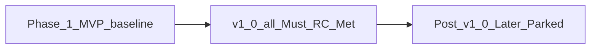

# REX v1.0 — milestone definition

Canonical **release criteria** and **SemVer** meaning for the first major milestone. [ROADMAP.md](ROADMAP.md) tracks progress toward these criteria; it does not redefine v1.0.

## References

| Source | Role |
|--------|------|
| [Semantic Versioning 2.0.0](https://semver.org/) | What `1.0.0` signals for public API stability |
| [semver FAQ — when to release 1.0.0](https://semantic-versioning.org/faq/) | Integrators depend on API; backward compatibility matters |
| [Release criteria (Johanna Rothman)](https://www.jrothman.com/articles/2002/03/release-criteria-is-this-software-done/) | SMART objective “done” statements |
| [PURPOSE_AND_PRINCIPLES.md](PURPOSE_AND_PRINCIPLES.md) | Project success definition |
| [DEVELOPER_EXPERIENCE_GUIDE.md](DEVELOPER_EXPERIENCE_GUIDE.md) §5 | `rex.v1` / NDJSON compatibility policy |
| [MVP_SPEC.md](MVP_SPEC.md) | Phase 1 baseline (feeds several criteria; not sufficient alone for v1.0) |

## Definition of success

REX succeeds when an operator can **dogfood** from the IDE on macOS: a **supervised sidecar agent**, **brokered HTTP** inference, and **daemon-enforced** stream and access policy—without embedding vendor SDKs in clients. That matches [PURPOSE_AND_PRINCIPLES.md](PURPOSE_AND_PRINCIPLES.md).

v1.0 is the first milestone where that path is **reference-complete** under explicit, measurable criteria—not a production SLA or supported distribution.

## Public API at 1.0.0 (Semantic Versioning)

| Version | Meaning for REX |
|---------|-----------------|
| **`0.y.z` (today: `0.1.0` in [Cargo.toml](../Cargo.toml))** | Initial development; public API **may change** without a major bump. |
| **`1.0.0`** | Public API **stable**; breaking client-visible changes require a **major** bump and documented migration. |

**Public API boundary** (see [DEVELOPER_EXPERIENCE_GUIDE.md](DEVELOPER_EXPERIENCE_GUIDE.md) §5):

- `proto/rex/v1/rex.proto` and generated **`rex.v1`** surfaces consumed by `rex-cli` and the extension.
- **`rex-cli complete --format ndjson`**: one terminal `done` or `error` per stream; conformance in [fixtures/ndjson_contract/](../fixtures/ndjson_contract/) and [EXTENSION.md](EXTENSION.md).
- **`rex.sidecar.v1`**: control plane distinct from `rex.v1`. Additive verbs and fields are allowed in minor releases; breaking changes require a **versioned** sidecar API migration (same discipline as `rex.v1`).

**Not implied by `1.0.0`:** long-term support, zero defects, feature completeness, remote TLS/auth, or withdrawal of the study-project framing in the purpose doc.

## What v1.0 does not promise

- Production SLA or commercial support.
- Apple MLX, multi-plugin fleets, durable long-term memory, MCP implementation, on-disk `rex config`, or Node gRPC streaming in the extension.
- VM/container as the default Mac sidecar envelope.

Deferred items: [ROADMAP.md](ROADMAP.md) **Later** and **Parked**.

## Release criteria (SMART)

Evaluate the **product** against these rows—not team activity alone. Status values: **Met**, **Partial**, **Not met**. **Canonical status lives here**; [ROADMAP.md](ROADMAP.md) mirrors for navigation.

**v1.0 Met** = every **Must** row **Met**.

| ID | Criterion | Type | Measure / evidence | Status |
|----|-----------|------|-------------------|--------|
| **RC-01** | `rex.v1` and NDJSON contract stable; breaking changes only via documented major migration | Contract | Conformance fixtures; [CI.md](CI.md); DX guide §5 | **Partial** — baseline shipped; ongoing compat discipline |
| **RC-02** | Operator path documented and script-verified: clone → HTTP backend → daemon+sidecar → extension chat | Customer-visible | [EXTENSION_LOCAL_E2E.md](EXTENSION_LOCAL_E2E.md); [scripts/verify_mvp_local.sh](../scripts/verify_mvp_local.sh) | **Partial** — docs/scripts exist; hub doc drift cleanup in progress |
| **RC-03** | Product `StreamInference` uses supervised sidecar; harness-only path not default acceptance | Capability | [MVP_SPEC.md](MVP_SPEC.md) criteria 1–2; [SIDECAR_RUNTIME.md](SIDECAR_RUNTIME.md) | **Met** |
| **RC-04** | Brokered HTTP inference for sidecar requests | Capability | [ADAPTERS.md](ADAPTERS.md); [CONFIGURATION.md](CONFIGURATION.md) | **Met** |
| **RC-05** | Centralized **AccessPolicy broker** evaluates all sidecar tool requests before host execution; structured deny | Capability | [POLICY_ENGINE.md](POLICY_ENGINE.md); [AGENT_ACCESS_POLICY.md](AGENT_ACCESS_POLICY.md); tests | **Not met** — broker RPCs exist; unified evaluation pipeline pending |
| **RC-06** | `ApprovalGate` + extension `--approval-id` when `REX_AGENT_APPROVALS=1` | Capability | [ADR 0009](architecture/decisions/0009-centralized-agent-approvals-and-checkpoints.md) | **Met** |
| **RC-07** | Stream reliability: cancel, single terminal NDJSON event, no silent hang on common paths | Quality | `uds_e2e`; extension tests | **Partial** |
| **RC-08** | Actionable failures for missing daemon, sidecar, HTTP backend, or `rex-cli` on PATH | Quality | CLI/extension messages; tests | **Partial** — extension setup hints in progress |
| **RC-09** | Economics floor: implemented matrix rows stable; routing logs **`route=`** and a **decision id** (beyond env-only hook) | Quality | [CONTEXT_EFFICIENCY.md](CONTEXT_EFFICIENCY.md); daemon logs/tests | **Partial** — env `routing::decide_route` shipped; decision id not yet required in logs |
| **RC-10** | Default PR CI green without live LLM | Internal audit | [CI.md](CI.md) | **Met** |

### Should (not blocking `1.0.0` tag)

| ID | Criterion | Evidence |
|----|-----------|----------|
| **RC-S1** | Extension `rex.modelId` passes `--model` on every `complete` | [EXTENSION_ROADMAP.md](EXTENSION_ROADMAP.md) |
| **RC-S2** | Long-session extension stress: cancel returns UI to idle | Extension tests; [EXTENSION_ROADMAP.md](EXTENSION_ROADMAP.md) |

## Milestone ladder

| Stage | Meaning |
|-------|---------|
| **Phase 1 baseline** | [MVP_SPEC.md](MVP_SPEC.md) success criteria largely **Implemented** (sidecar, broker, extension loop). |
| **v1.0** | All Must **RC-*** **Met**; ready to tag workspace **`1.0.0`**. |
| **Post-v1.0** | [ROADMAP.md](ROADMAP.md) Next/Later/Parked (MCP, L2 cache, MLX, etc.). |

## When to tag `1.0.0`

1. Confirm every Must **RC-*** row is **Met** in the table above.
2. Bump `version` in [Cargo.toml](../Cargo.toml) workspace package to **`1.0.0`** in a dedicated PR (after implementation gaps close).
3. Note extension release policy in [EXTENSION_RELEASE.md](EXTENSION_RELEASE.md) (extension may keep independent `rex-vscode-v*` tags; reference workspace v1.0 in release notes when aligned).

Do **not** tag `1.0.0` when this document is first added—criteria must be **Met** first.

## How to refresh

1. After closing an **RC-*** gap in code or docs, update **Status** here, then mirror in [ROADMAP.md](ROADMAP.md) **Release criteria status**.
2. If a criterion changes, edit this hub first; link from [PRIORITIZATION.md](PRIORITIZATION.md) MoSCoW **Must** = unmet Must **RC-***.

## Related

- [ROADMAP.md](ROADMAP.md) — work queue mapped to **RC-***
- [PRIORITIZATION.md](PRIORITIZATION.md) — bucketing
- [MVP_SPEC.md](MVP_SPEC.md) — Phase 1 scope and acceptance
