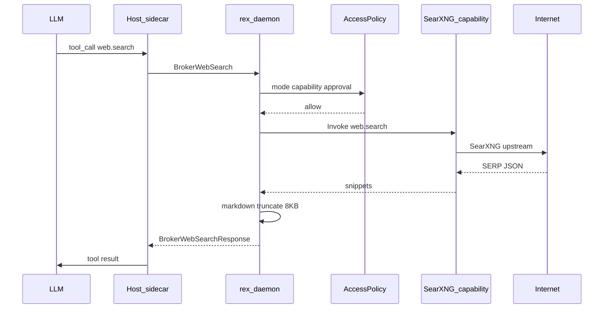

# Web search (design hub)

> Role: explanation | Status: planned | Audience: contributors | Read when: web search capability sidecar
> Prefer: ## Purpose

Canonical design for the **`web.search`** broker tool: live web grounding via a **SearXNG capability sidecar**, routed through `rex-daemon` policy. See [CAPABILITY_SIDECARS.md](CAPABILITY_SIDECARS.md) for the host/capability sidecar model.

## Purpose

Agents need current documentation, release notes, and external error context without bypassing Rex's trust boundary. `web.search` returns compressed markdown snippets from ranked results so one tool call fits the **8192-byte** broker limit and the default **12-step** tool loop.

## Status

**Design accepted** — [ADR 0029](architecture/decisions/0029-web-search-via-capability-sidecar.md). **Not implemented** — roadmap **R055** (after **R056** capability fleet).

## Scope

### In (v1 design)

- Tool name **`web.search`** on host sidecar (`rex-agent`)
- Broker RPC **`BrokerWebSearch`** on `rex.v1` → daemon **`Invoke`** → **SearXNG capability sidecar**
- Unified single tool (no separate `web.fetch` in v1)
- Default **`enabled: false`**
- **No API key** on SearXNG path (operator hosts SearXNG)
- **Approval required** in `agent` mode; **allow** in `plan`; **deny** in `ask`
- v1 **NDJSON tool-progress** stream event during invoke
- Per-turn rate cap, L2 query cache, daemon-side markdown formatting + truncation

### Out (v1)

- Brave LLM Context API as default (documented as **future alternate**)
- Generic **`net.fetch`** — remains Won't; see [AGENT_ACCESS_POLICY.md](AGENT_ACCESS_POLICY.md)
- Headless browser / MCP search servers
- Host sidecar HTTP egress
- Local LLM summarization of results

## Boundaries

## Tool schema (host registration intent)

| Parameter | Type | Required | Notes |
|-----------|------|----------|-------|
| `query` | string | yes | Search query |
| `recency` | enum | no | `past_day`, `past_week`, `past_month`, `past_year`, `any` (default `any`) |
| `site_filter` | string | no | Domain restrict, e.g. `docs.rs` |

## Mode × capability

| Mode | `web.search` |
|------|----------------|
| `ask` | **Deny** |
| `plan` | **Allow** (read-only external retrieval) |
| `agent` | **Allow** + **ApprovalGate** ([ADR 0009](architecture/decisions/0009-centralized-agent-approvals-and-checkpoints.md)) |

## SearXNG capability sidecar (intent)

| Topic | Design |
|-------|--------|
| **Location** | `sidecars/searxng-capability/` (implementation deferred) |
| **Contract** | `rex.capability.v1`; advertises `web.search` |
| **SearXNG** | Operator self-host or Rex-supervised local instance (Docker/subprocess) |
| **Network** | Scoped egress in capability process only |
| **Wire to daemon** | JSON SERP; daemon formats numbered markdown (title, URL, date, snippet) |
| **License** | SearXNG is **AGPL-3.0** — operator responsibility when self-hosting; Rex ships a thin adapter |

## Broker and config (intent)

**`rex.v1` RPC:** `BrokerWebSearch(BrokerWebSearchRequest) → BrokerWebSearchResponse` — request carries `query`, optional `recency`, `site_filter`, `mode`; response carries `ok`, markdown `content`, optional `error_code`.

**Config namespace:** `broker.web_search` (enablement, timeouts, rate limits, cache TTL) plus capability entry under `sidecars.capabilities[]` — see [CONFIGURATION.md](CONFIGURATION.md).

| Key | Default | Purpose |
|-----|---------|---------|
| `enabled` | `false` | Master switch |
| `timeout_secs` | `10` | Invoke + upstream budget |
| `max_results` | `3` | Snippets in formatted output |
| `max_queries_per_turn` | `3` | Per-turn rate cap |
| `cache_ttl_hours` | `12` | L2 cache TTL |

## Security

- Host sidecar: **no** ambient network.
- Invoke payload: **query strings only** in v1 — no arbitrary URLs from the model.
- Persistent logs: **redact** raw query text; log query hash, byte count, capability id.
- Per-turn dedup: identical normalized query in one turn returns cached markdown.

## Error codes (intent)

Register in [ERROR_HANDLING.md](ERROR_HANDLING.md) and `fixtures/guidelines/broker_error_codes.yaml` at implementation.

| Code | Condition |
|------|-----------|
| `web_search_disabled` | Feature or capability sidecar off |
| `web_search_denied` | Mode or policy deny |
| `web_search_approval_required` | Agent mode without approval |
| `web_search_rate_limited` | Per-turn budget exceeded |
| `web_search_timeout` | Invoke or upstream timeout |
| `web_search_provider_error` | SearXNG or upstream 5xx |
| `capability_unavailable` | Capability sidecar down |
| `capability_not_registered` | No provider for `web.search` |

## Economics

| Lever | Notes |
|-------|-------|
| **SearXNG path** | No per-query API fee; operator pays hosting/latency |
| **Cache hit** | Zero marginal cost; near-zero latency |
| **Rate cap** | `max_queries_per_turn` protects loop and upstream |

Row in [CONTEXT_EFFICIENCY.md](CONTEXT_EFFICIENCY.md).

## Testing (design)

| Tier | Approach |
|------|----------|
| **CI** | Mock capability sidecar + fixture SERP JSON — no live network |
| **Opt-in live** | Operator enables SearXNG + `verify_web_search_live.sh` pattern (future script) |

## Future alternates

| Backend | Notes |
|---------|-------|
| **Brave LLM Context API** | BYOK via Keychain; daemon-inline or second capability — higher snippet quality, API cost |
| **Provider-native search** | When inference uses Anthropic Messages API with bundled `web_search_*` tool — separate track |

## Prioritization

| Field | Value |
|-------|-------|
| **MoSCoW** | **Could** |
| **Depends on** | **R056** capability sidecar fleet |
| **Roadmap** | **R055**; extension UX **E-WS01** |

## Implementation slices (reference)

| ID | Outcome |
|----|---------|
| **R055-1** | `BrokerWebSearch` + policy + error catalog |
| **R055-2** | SearXNG capability sidecar + SERP→markdown |
| **R055-3** | Host tool + approval + stream events |
| **R055-4** | Cache, rate limits, opt-in live smoke |

## Cross-links

- [CAPABILITY_SIDECARS.md](CAPABILITY_SIDECARS.md)
- [AGENT_ACCESS_POLICY.md](AGENT_ACCESS_POLICY.md)
- [NATIVE_TOOL_CALLING.md](NATIVE_TOOL_CALLING.md)
- [ERROR_HANDLING.md](ERROR_HANDLING.md)
- [STREAM_EVENTS.md](STREAM_EVENTS.md) — tool-progress NDJSON (**E-WS01**)
