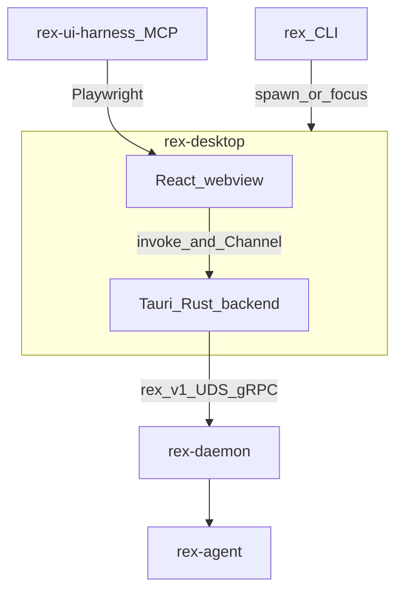

# Web UI architecture


> Role: explanation | Status: active | Audience: contributors | Read when: web desktop harness architecture
> Prefer: ## Purpose

**Status:** `design accepted` — [ADR 0042](architecture/decisions/0042-web-desktop-presentation-pivot.md). Product design: [WEB_UI_DESIGN.md](WEB_UI_DESIGN.md). Operator UX: [OPERATOR_UX.md](OPERATOR_UX.md) (pending migration from CLI_OPERATOR_UX).

## Purpose

Define the **technical architecture** for Rex’s web-native desktop harness: Tauri shell, UDS gRPC bridge, streaming IPC, and agent validation — while intelligence stays in **`rex-daemon`**.

## Scope

**In:**

- Desktop shell (Tauri 2 + React 19 webview).
- UDS proxy and `tauri::ipc::Channel` streaming topology.
- Shared stream normalization via `rex-stream-ui`.
- rex-ui-harness MCP validation strategy.
- Monorepo layout and deployment lifecycle outline.

**Out:**

- Visual tokens, motion tiers, component catalog ([WEB_UI_DESIGN.md](WEB_UI_DESIGN.md)).
- macOS code signing CI detail (W107, post-MVP).
- Sidecar supervision ([SIDECAR_RUNTIME.md](SIDECAR_RUNTIME.md)).

## Container view



| Component | Responsibility |
|-----------|----------------|
| `rex` CLI | Ensures daemon; spawns/focuses desktop window; setup subcommands unchanged |
| `crates/rex-desktop` | UDS tonic client, daemon lifecycle, Channel fan-out, macOS menu |
| `apps/rex-web` | Presentation only — transcript, timeline, composer, modals |
| `rex-daemon` | Intelligence, policy, `StreamInference`, approvals (unchanged) |
| `rex-stream-ui` | gRPC/NDJSON → `StreamEvent` / `UiEffect` (Rust, consumed in Tauri backend) |
| `rex-ui-harness` | MCP tools for token, layout, motion, and baseline assertions |

## Transport architecture

### Unary control plane

Webview invokes Tauri commands; Rust backend issues tonic UDS calls:

- `GetSystemStatus` — daemon health, workspace binding
- `FetchSessionEvents` — transcript hydration
- `RespondToToolApproval` — approval gate

Metadata: `x-rex-harness-session-id`, `x-rex-trace-id` (same as CLI TUI path).

### Streaming plane

`StreamInference` server stream → Rust backend `StreamConsumer` (`rex-stream-ui`) → ordered events on `tauri::ipc::Channel`.

**Why Channel, not commands:** per-chunk JSON-RPC serialization creates IPC bottlenecks during token streaming.

**Backpressure:** ring buffer per subscription; drop or coalesce only at presentation tier, never at daemon boundary.

**Reconnection:** Rust task probes UDS; emits `daemon_connecting` / `daemon_ready` / `daemon_unavailable` to webview.

### What the webview must not do

- Open UDS sockets directly (no Unix socket from JavaScript).
- Spawn or control sidecars (`rex.sidecar.v1` stays daemon-internal).
- Bypass daemon broker for filesystem or shell operations.

## Project structure

```
crates/rex-desktop/     # Tauri 2 Rust backend
apps/rex-web/           # React 19 + Vite frontend
crates/rex-ui-harness/  # MCP server + Playwright runner
fixtures/ui_probe/      # Mock scenarios + bootstrap pages
proto/rex/v1/           # Shared contract (unchanged)
```

Shared protobuf compiles to Rust (`rex-proto`) and TypeScript interfaces for webview types (generated or hand-maintained DTO mirrors).

## Deployment lifecycle (outline)

| Phase | Deliverable |
|-------|-------------|
| Dev | `cargo tauri dev` + Vite HMR |
| CI | rex-ui-harness browser mode; native WKWebView after tauri-plugin-playwright |
| Release | GitHub Actions + Developer ID signing + `tauri-plugin-updater` (W107) |

macOS Gatekeeper requires notarization for distribution; deferred until post-MVP shell is stable.

## Testing strategy

### Single UI contract

Validation MUST exercise the same frontend artifact operators receive:

1. **`apps/rex-web/dist`** — built via `npm run build`; Tauri `frontendDist` and rex-ui-harness desktop mode both load this bundle (`vite preview` on port 5173 for harness + debug `devUrl` parity).
2. **No alternate presentation code** — mock scenarios belong in daemon config (`fixtures/ui_probe/rex_root/`), not duplicate HTML/React trees.
3. **Harness stack** — Tauri + `e2e-testing` + tauri-plugin-playwright + mock daemon; intelligence path matches bare `rex`.

| Layer | Tool | Asserts |
|-------|------|---------|
| Tokens | `ui_assert_token` | CIEDE2000 ΔE2000 vs `--rex-*` CSS variables |
| Layout | `ui_assert_layout` | Grid/flex containment |
| Motion | `ui_clock_step` + `ui_assert_motion` | Deterministic animation frames |
| Regression | `ui_diff_baseline` | looks-same PNG compare |
| Native | tauri-plugin-playwright | WKWebView + CoreGraphics typography |

Legacy tuiwright PTY snapshots are retired with TUI removal.

## Related

- [ADR 0042](architecture/decisions/0042-web-desktop-presentation-pivot.md)
- [WEB_UI_DESIGN.md](WEB_UI_DESIGN.md)
- [WEB_UI_ROADMAP.md](WEB_UI_ROADMAP.md)
- [NDJSON_STREAM.md](NDJSON_STREAM.md) — automation contract (unchanged)
- [ARCHITECTURE.md](ARCHITECTURE.md)
