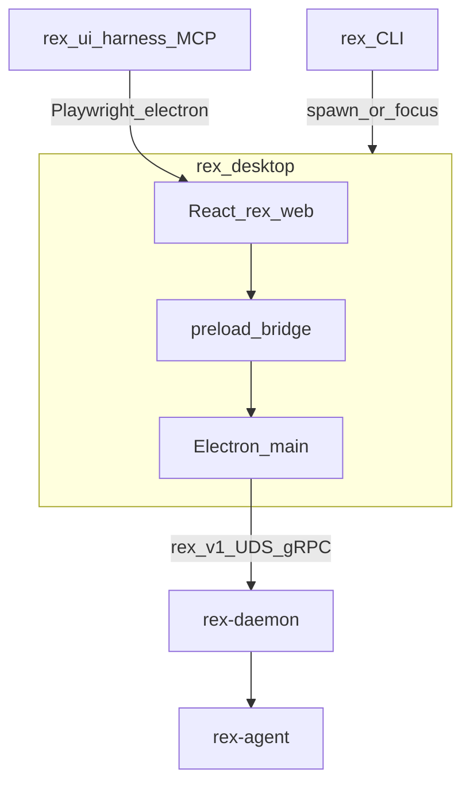

# Web UI architecture


> Role: explanation | Status: active | Audience: contributors | Read when: web desktop harness architecture
> Prefer: ## Purpose

**Status:** `design accepted` — [ADR 0043](architecture/decisions/0043-electron-shell-for-electric-alive-compositor.md) (shell); pivot context [ADR 0042](architecture/decisions/0042-web-desktop-presentation-pivot.md). Product design: [WEB_UI_DESIGN.md](WEB_UI_DESIGN.md). Operator UX: [OPERATOR_UX.md](OPERATOR_UX.md).

## Purpose

Define the **technical architecture** for Rex’s web-native desktop harness: Electron shell, UDS gRPC bridge, streaming IPC, and agent validation — while intelligence stays in **`rex-daemon`**.

## Scope

**In:**

- Desktop shell (Electron + React 19 Chromium webview).
- UDS proxy in Electron **main** and preload `contextBridge` streaming topology.
- Shared stream event vocabulary (`rex-stream-ui` semantics / TS gRPC client in main).
- rex-ui-harness MCP validation strategy (Electron host).
- Monorepo layout and deployment lifecycle outline.

**Out:**

- Visual tokens, motion tiers, component catalog ([WEB_UI_DESIGN.md](WEB_UI_DESIGN.md)).
- macOS code signing CI detail (W107, post-MVP).
- Sidecar supervision ([SIDECAR_RUNTIME.md](SIDECAR_RUNTIME.md)).

## Container view



| Component | Responsibility |
|-----------|----------------|
| `rex` CLI | Ensures daemon; spawns/focuses desktop window; setup subcommands unchanged |
| `apps/rex-desktop` | Electron main: UDS client, daemon lifecycle, stream fan-out, macOS menu |
| `apps/rex-web` | Presentation only — transcript, timeline, composer, modals, Electric Alive canvases |
| `rex-daemon` | Intelligence, policy, `StreamInference`, approvals (unchanged) |
| Stream projection | Main-process gRPC / `rex-stream-ui` semantics → IPC events to renderer |
| `rex-ui-harness` | MCP tools for token, layout, motion, compositor proof, and baseline assertions |

## Transport architecture

### Unary control plane

Renderer calls preload APIs; Electron main issues UDS gRPC calls:

- `GetSystemStatus` — daemon health, workspace binding
- `FetchSessionEvents` — transcript hydration
- `RespondToToolApproval` — approval gate

Metadata: `x-rex-harness-session-id`, `x-rex-trace-id` (same as prior desktop path).

### Streaming plane

`StreamInference` server stream → Electron main consumer → ordered events on an IPC channel to the renderer.

**Why not renderer UDS:** the webview must not open Unix sockets ([What the webview must not do](#what-the-webview-must-not-do)).

**Backpressure:** ring buffer per subscription in main; drop or coalesce only at presentation tier, never at daemon boundary.

**Reconnection:** Main probes UDS; emits `daemon_connecting` / `daemon_ready` / `daemon_unavailable` to the renderer.

### What the webview must not do

- Open UDS sockets directly (no Unix socket from JavaScript).
- Spawn or control sidecars (`rex.sidecar.v1` stays daemon-internal).
- Bypass daemon broker for filesystem or shell operations.
- Run with Node integration enabled (Electron: `contextIsolation`, no Node in renderer).

## Project structure

```
apps/rex-desktop/           # Electron main + preload + packaging
apps/rex-web/               # React 19 + Vite presentation (sole operator UI)
crates/rex-ui-harness/      # MCP server + Playwright runner (Electron)
fixtures/ui_probe/          # Mock scenarios + bootstrap
proto/rex/v1/               # Shared contract (unchanged)
```

Shared protobuf compiles to Rust (`rex-proto`) and TypeScript interfaces for webview types (generated or hand-maintained DTO mirrors).

## Deployment lifecycle (outline)

| Phase | Deliverable |
|-------|-------------|
| Dev | Electron loads `apps/rex-web/dist` (same bundle as release) |
| CI | rex-ui-harness desktop mode on Electron; compositor proof gate |
| Release | GitHub Actions + Developer ID signing (W107) |

macOS Gatekeeper requires notarization for distribution; deferred until post-MVP shell is stable.

## Testing strategy

### Single UI contract

Validation MUST exercise the same frontend artifact operators receive:

1. **`apps/rex-web/dist`** — built via `npm run build`; Electron and rex-ui-harness desktop mode all load this bundle.
2. **No alternate presentation code** — mock scenarios belong in daemon config (`fixtures/ui_probe/rex_root/`), not duplicate HTML/React trees.
3. **Harness stack** — Electron + Playwright + mock daemon; intelligence path matches bare `rex`.

### Compositor proof (required)

Electric Alive uses fullscreen WebGL. Before shipping WebGL mounts on a host, desktop verify MUST prove **chrome + fullscreen WebGL co-visibility for ≥5 seconds**:

| Check | Rule |
|-------|------|
| Timing | Sample at least t=0, 1s, 3s, 5s after WebGL init |
| Paint | Chrome luminance not background-only (same class of gate as shell chrome painted asserts) |
| Hit-test | Shell contains composer/header target under `elementFromPoint` |
| Failure | Any sample failing = CI failure (bury) |
| Empty run | Harness TestExecution with no steps must not report success |

| Layer | Tool | Asserts |
|-------|------|---------|
| Tokens | `ui_assert_token` | CIEDE2000 ΔE2000 vs `--rex-*` CSS variables |
| Layout | `ui_assert_layout` | Grid/flex containment |
| Motion | `ui_clock_step` + `ui_assert_motion` | Deterministic animation frames |
| Compositor | proof samples | Chrome + WebGL co-visible ≥5s |
| Regression | `ui_diff_baseline` | looks-same PNG compare |
| Native | Playwright Electron | Chromium desktop host |

Legacy tuiwright PTY snapshots and Tauri/WKWebView harness hosts are retired from the product path.

## Related

- [ADR 0043](architecture/decisions/0043-electron-shell-for-electric-alive-compositor.md)
- [ADR 0042](architecture/decisions/0042-web-desktop-presentation-pivot.md) (pivot; shell superseded)
- [WEB_UI_DESIGN.md](WEB_UI_DESIGN.md)
- [WEB_UI_ROADMAP.md](WEB_UI_ROADMAP.md)
- [STREAM_EVENTS.md](STREAM_EVENTS.md) — internal stream event vocabulary
- [ARCHITECTURE.md](ARCHITECTURE.md)
