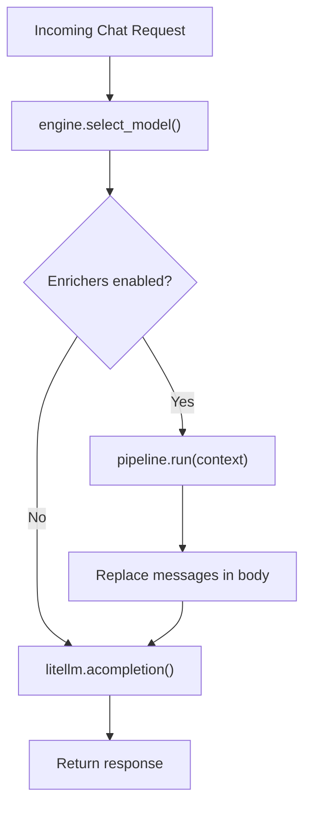

# Phase 2 — Enrichment Pipeline

For the full delivery plan, see [ROADMAP.md](../../ROADMAP.md). For system design and routing strategy, see [ARCHITECTURE.md](../../ARCHITECTURE.md).

---

## Goal

- Build a pluggable pipeline that transforms requests after routing but before the model call.
- Each enricher is opt-in, toggled independently via config.
- The first enricher (task decomposition) detects complex tasks and injects a system-level instruction telling the model to break the task into numbered steps.
- The pipeline only applies to `chat` requests — `completion` requests skip it entirely.
- Zero overhead when no enrichers are enabled.

---

## Enricher Interface

Each enricher implements a single method:

```python
class Enricher(Protocol):
    def enrich(self, context: EnrichmentContext) -> EnrichmentContext: ...
```

`EnrichmentContext` carries the request data an enricher can read and modify:

| Field | Type | Description |
|---|---|---|
| `messages` | `list[dict]` | The messages array from the request body |
| `category` | `TaskCategory` | The classified task category |
| `confidence` | `float` | The classifier's confidence score |
| `feature_type` | `FeatureType` | `COMPLETION` or `CHAT` |

- An enricher receives the context, optionally modifies `messages`, and returns the context.
- Enrichers must not modify fields other than `messages`.
- If an enricher decides the request does not qualify, it returns the context unchanged.

---

## Pipeline Runner

The pipeline runner executes enabled enrichers in sequence:

```python
class EnrichmentPipeline:
    def __init__(self, enrichers: list[Enricher]) -> None: ...
    def run(self, context: EnrichmentContext) -> EnrichmentContext: ...
```

- `run()` passes the context through each enricher in order.
- Each enricher receives the output of the previous one.
- If the enricher list is empty, `run()` returns the context unchanged.
- The pipeline never raises — if an enricher fails, it logs the error and passes the context through unchanged.

---

## Task Decomposition Enricher

The first enricher. When enabled, it detects complex tasks and injects a system-level instruction into the messages array.

### Complexity Detection

The enricher uses signals already available after classification to decide whether a task is complex:

| Signal | Condition | Rationale |
|---|---|---|
| Feature type | `CHAT` only | Tab completions never need decomposition |
| Task category | `generation`, `refactoring`, `migration`, `code_review`, `test_generation` | These categories are inherently multi-step |
| Prompt length | > 500 characters | Longer prompts tend to describe multi-concern tasks |

The enricher skips tasks that do not meet any of the following:
- The task category is in the complex set (`generation`, `refactoring`, `migration`, `code_review`, `test_generation`).
- The prompt length exceeds the threshold (500 characters).

Simple categories (`completion`, `explanation`, `documentation`, `general`, `debugging`, `optimization`) skip enrichment regardless of prompt length.

### Injected Instruction

When the enricher determines the task is complex, it appends the following to the existing system message content (or creates a system message if none exists):

```
Before starting, break this task into a numbered list of concrete subtasks. Work through each subtask one at a time. State which subtask you are working on and mark it done before moving to the next.
```

- The enricher appends to the existing system message — it never replaces it.
- If no system message exists, the enricher inserts one at position 0 of the messages array.
- The instruction text is a constant defined in the enricher module.

### Categories

| Category | Enriched | Rationale |
|---|---|---|
| `generation` | Yes | Writing new code from a description involves multiple files, functions, or layers |
| `refactoring` | Yes | Restructuring touches multiple locations and requires a sequence |
| `migration` | Yes | Upgrades span dependencies, code changes, and config updates |
| `code_review` | Yes | Reviews cover multiple concerns (correctness, style, security, performance) |
| `test_generation` | Yes | Test suites cover multiple scenarios, edge cases, and setup steps |
| `completion` | No | Single-line completions are atomic |
| `debugging` | No | Typically focused on a single error |
| `optimization` | No | Usually targets a specific bottleneck |
| `explanation` | No | Answering a question, not executing a task |
| `documentation` | No | Typically a single-concern task |
| `general` | No | Fallback category, no special handling |

---

## Config Schema

Add an `enrichments` section to the existing config:

```yaml
enrichments:
  task_decomposition: true
```

### EnrichmentsConfig

| Field | Type | Required | Default | Description |
|---|---|---|---|---|
| `enrichments.task_decomposition` | boolean | no | `false` | Enable the task decomposition enricher |

- The `enrichments` section is optional — omitting it entirely means no enrichments.
- All enrichments default to `false` (off).
- The `EnrichmentsConfig` Pydantic model validates the section and provides defaults.

### Settings Extension

The existing `Settings` model gains a new optional field:

```python
class EnrichmentsConfig(BaseModel):
    task_decomposition: bool = False

class Settings(BaseModel):
    server: ServerConfig = ServerConfig()
    models: list[ModelConfig] = []
    routing: RoutingConfig = RoutingConfig()
    enrichments: EnrichmentsConfig = EnrichmentsConfig()
```

---

## Integration

The enrichment pipeline runs inside `handle_chat_completion` in `proxy/handler.py`, between model selection and the LiteLLM call.

### Request Flow



- `handle_chat_completion` builds the `EnrichmentContext` from the request body and the classifier result.
- The pipeline modifies `messages` in place (or returns them unchanged).
- The modified `messages` replace the original in the request body before the LiteLLM call.
- `handle_text_completion` does not use the enrichment pipeline — it handles legacy completions only.

### How the Classifier Result Reaches the Pipeline

Currently, `engine.select_model()` runs classification internally and returns only the selected `ModelConfig`. The enrichment pipeline needs the `ClassificationResult` (category + confidence) and the `FeatureType`.

`select_model()` returns a `RoutingDecision` dataclass instead of a bare `ModelConfig`:

```python
@dataclass(frozen=True)
class RoutingDecision:
    model: ModelConfig
    category: TaskCategory
    confidence: float
    feature_type: FeatureType
```

- `handle_chat_completion` unpacks `RoutingDecision` to get both the model and the classification data for the enrichment pipeline.
- `handle_text_completion` and fallback logic use `decision.model` where they previously used the `ModelConfig` directly.

---

## Project Files

Phase 2 adds the enrichment module and modifies existing files:

```
app/
  config.py                # Add EnrichmentsConfig, extend Settings
  enrichment/
    __init__.py
    context.py             # EnrichmentContext dataclass
    pipeline.py            # EnrichmentPipeline runner
    task_decomposition.py  # Task decomposition enricher
  proxy/
    handler.py             # Integrate pipeline into handle_chat_completion
  router/
    engine.py              # Return RoutingDecision instead of ModelConfig
tests/
  test_enrichment_pipeline.py
  test_task_decomposition.py
```

### enrichment/context.py

- `EnrichmentContext` dataclass: `messages`, `category`, `confidence`, `feature_type`.

### enrichment/pipeline.py

- `Enricher` protocol: single `enrich(context) -> context` method.
- `EnrichmentPipeline` class: takes a list of enrichers, runs them in sequence.
- `build_pipeline(settings) -> EnrichmentPipeline` factory: reads `settings.enrichments` and constructs the enricher list.

### enrichment/task_decomposition.py

- `COMPLEX_CATEGORIES` frozenset: `generation`, `refactoring`, `migration`, `code_review`, `test_generation`.
- `PROMPT_LENGTH_THRESHOLD` constant: `500`.
- `DECOMPOSITION_INSTRUCTION` constant: the instruction text to inject.
- `TaskDecompositionEnricher` class implementing the `Enricher` protocol.
- `_is_complex(context) -> bool`: checks category membership and prompt length.
- `enrich(context) -> context`: if complex, appends instruction to system message; otherwise returns unchanged.

### router/engine.py (modified)

- `RoutingDecision` dataclass: `model`, `category`, `confidence`, `feature_type`.
- `select_model()` returns `RoutingDecision` instead of `ModelConfig`.

### proxy/handler.py (modified)

- `handle_chat_completion` unpacks `RoutingDecision`, builds `EnrichmentContext`, runs the pipeline, and uses the (potentially modified) messages for the LiteLLM call.

### config.py (modified)

- `EnrichmentsConfig` Pydantic model with `task_decomposition: bool = False`.
- `Settings` gains `enrichments: EnrichmentsConfig = EnrichmentsConfig()`.

---

## Verification

### Enrichment Pipeline

1. Configure `enrichments.task_decomposition: true` in `config.yaml`.
2. Send a `generation` request with a long prompt describing multiple requirements:
   ```bash
   curl -X POST http://localhost:8000/v1/chat/completions \
     -H "Content-Type: application/json" \
     -d '{"messages": [{"role": "user", "content": "Build a REST API with user authentication, a products endpoint with CRUD operations, and a shopping cart that persists across sessions"}]}'
   ```
3. Verify the model's response follows a numbered step-by-step structure.

### No Enrichment for Simple Tasks

4. Send an `explanation` request:
   ```bash
   curl -X POST http://localhost:8000/v1/chat/completions \
     -H "Content-Type: application/json" \
     -d '{"messages": [{"role": "user", "content": "What does async/await do in Python?"}]}'
   ```
5. Verify the response is a direct answer without step-by-step decomposition.

### Opt-Out

6. Remove the `enrichments` section from config (or set `task_decomposition: false`).
7. Repeat step 2 and verify the response is not decomposed into steps.

### Tab Completions Skip Enrichment

8. Send a short single-turn completion request:
   ```bash
   curl -X POST http://localhost:8000/v1/chat/completions \
     -H "Content-Type: application/json" \
     -d '{"messages": [{"role": "user", "content": "def fibonacci(n):"}], "max_tokens": 50, "temperature": 0}'
   ```
9. Verify the response is a direct code completion without decomposition.
