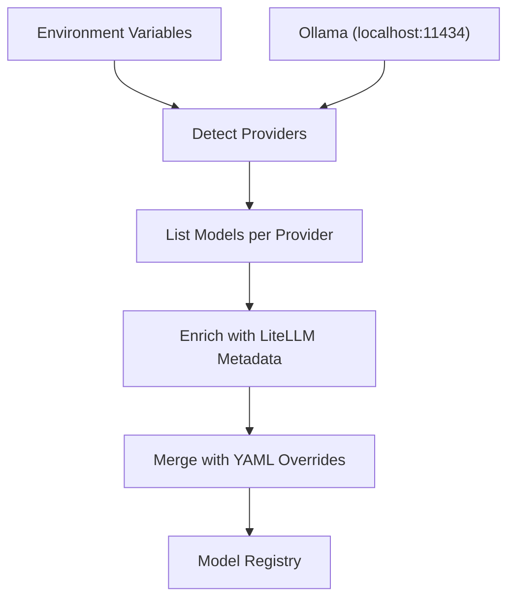
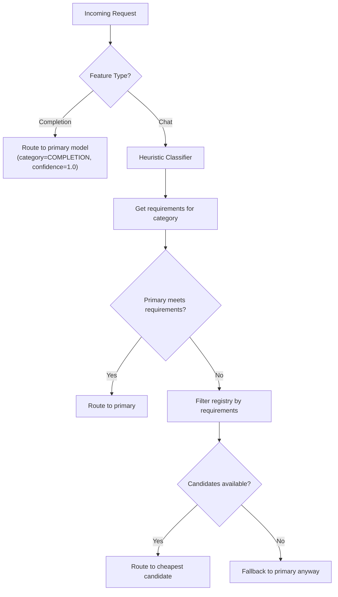

# Phase 0 — Proxy + Basic Routing

For the full delivery plan, see [ROADMAP.md](../../ROADMAP.md). For system design and routing strategy, see [ARCHITECTURE.md](../../ARCHITECTURE.md).

---

## Goal

- Build an OpenAI-compatible proxy that routes requests across multiple model backends based on feature detection.
- Discover available models automatically from environment variables, provider APIs, and local runtimes — zero configuration required.
- Route tab completions to the cheapest model and chat/agent requests through a task-aware classifier.
- Support both streaming (SSE) and non-streaming responses.
- Pass through unknown endpoints transparently to the primary model's backend.

---

## Model Discovery

Rex discovers available models at startup through a three-step pipeline: detect providers, list their models, and enrich each model with metadata.



### Provider Detection

The discovery module scans for known API keys in environment variables and probes local runtimes:

| Environment Variable | Provider Prefix |
|---|---|
| `OPENAI_API_KEY` | `openai` |
| `ANTHROPIC_API_KEY` | `anthropic` |
| `GROQ_API_KEY` | `groq` |
| `GEMINI_API_KEY` | `gemini` |
| `XAI_API_KEY` | `xai` |
| `TOGETHERAI_API_KEY` | `togetherai` |
| `MISTRAL_API_KEY` | `mistral` |
| `COHERE_API_KEY` | `cohere` |

- For each env var that is set, the detector creates a `DetectedProvider` with the prefix and API key.
- The detector probes Ollama at `http://localhost:11434/api/tags`. On success, it adds an Ollama provider with `is_local=True`.

### DetectedProvider

```python
@dataclass
class DetectedProvider:
    prefix: str
    api_key: str | None = None
    api_base: str | None = None
    is_local: bool = False
```

### Model Listing

For each detected provider, the discovery module queries the provider's API for available models:

| Provider | Endpoint | Auth |
|---|---|---|
| OpenAI, Groq, xAI, Together AI, Mistral, Cohere | `/v1/models` (OpenAI-compatible) | Bearer token |
| Anthropic | `/v1/models` | `x-api-key` header + `anthropic-version` |
| Ollama | `/api/tags` (local) | None |
| Gemini | Google Generative Language API | API key query parameter |

- Each model ID is prefixed with the provider name (e.g., `openai/gpt-4o`, `ollama/llama3`).

### Metadata Enrichment

The discovery module enriches each model with metadata from LiteLLM's built-in database via `litellm.get_model_info()`:

| Field | Source |
|---|---|
| `cost_per_1k_input` | `input_cost_per_token * 1000` |
| `max_context_window` | `max_input_tokens` or `max_tokens` |
| `supports_function_calling` | LiteLLM capability flag |
| `supports_reasoning` | LiteLLM capability flag |
| `supports_vision` | LiteLLM capability flag |

- If LiteLLM has no info for a model, the enricher keeps defaults: `cost=0.0`, capabilities `False`, context window `None`.
- `is_local` comes from the provider, not LiteLLM.

### ModelConfig

```python
class ModelConfig(BaseModel):
    name: str
    api_key: str | None = None
    api_base: str | None = None
    cost_per_1k_input: float = 0.0
    is_local: bool = False
    max_context_window: int | None = None
    supports_function_calling: bool = False
    supports_reasoning: bool = False
    supports_vision: bool = False
```

### YAML Overrides

- Config is optional. When `config.yaml` exists, the loader parses it into a `Settings` object.
- Manual `models` entries in the YAML override discovered models by name (last write wins).
- If no models are discovered and none are configured, Rex exits with an error at startup.

---

## Model Registry

The `ModelRegistry` holds all discovered and configured models in memory:

```python
class ModelRegistry:
    def __init__(self, models: list[ModelConfig]) -> None: ...
    def get_by_name(self, name: str) -> ModelConfig | None: ...
    def get_all(self) -> list[ModelConfig]: ...
    def sorted_by_cost(self) -> list[ModelConfig]: ...
    def filter_by_requirements(self, requirements: TaskRequirements) -> list[ModelConfig]: ...
    def names(self) -> list[str]: ...
```

### Cost Sorting

`sorted_by_cost()` sorts models by `(not is_local, cost_per_1k_input)`:

- Local models sort first (regardless of cost).
- Within each group, cheaper models sort first.

### Requirement Filtering

`filter_by_requirements()` drops models that fail any requirement, then sorts by cost:

- `min_context_window`: drop models with `max_context_window` below the required minimum (models with `None` context window pass).
- `needs_function_calling`: drop models where `supports_function_calling` is `False`.
- `needs_reasoning`: drop models where `supports_reasoning` is `False`.
- `needs_cloud`: drop models where `is_local` is `True`.

---

## Feature Detection

The detector classifies requests as `COMPLETION` (tab completion) or `CHAT` (interactive conversation) using a scoring heuristic:

| Signal | COMPLETION | CHAT |
|---|---|---|
| Single user message | +0.3 | — |
| Multiple user messages | — | -0.3 (from COMPLETION perspective) |
| Short prompt (<200 chars) | +0.2 | — |
| Long prompt (>500 chars) | — | -0.2 (from COMPLETION perspective) |
| `max_tokens` < 500 | +0.2 | — |
| `max_tokens` is `None` | — | -0.1 (from COMPLETION perspective) |
| `temperature` ≤ 0.2 | +0.2 | — |
| `temperature` is `None` or > 0.5 | — | -0.1 (from COMPLETION perspective) |

- If the accumulated score ≥ 0.5 → `COMPLETION`, else `CHAT`.

---

## Routing Engine

The `RoutingEngine` selects a model for each request:

```python
@dataclass(frozen=True)
class RoutingDecision:
    model: ModelConfig
    category: TaskCategory
    confidence: float
    feature_type: FeatureType
```

### Primary Model Selection

- If `routing.primary_model` is set in config, the engine uses that model.
- Otherwise, the engine auto-selects the first model from `sorted_by_cost()` (cheapest local model, then cheapest cloud model).

### Routing Flow



- Completions skip classification entirely and route to the primary model.
- Chat requests go through the heuristic classifier (Phase 1) to determine the task category.
- The engine matches the category's `TaskRequirements` against the registry.
- If the primary model meets the requirements, it wins. Otherwise, the cheapest model that meets the requirements wins.
- If no model meets the requirements, the engine falls back to primary.

### Fallback Chain

When the selected model fails (LiteLLM error), the handler tries the remaining models in cost order:

1. Selected model (from routing decision).
2. All other models from `sorted_by_cost()`, excluding the selected model.
3. If all models fail, the handler re-raises the last exception.

---

## API Surface

Rex exposes a fully OpenAI-compatible API:

| Endpoint | Handler | Behavior |
|---|---|---|
| `POST /v1/chat/completions` | `chat_completions` | Classification + routing + optional enrichment. Supports streaming. |
| `POST /v1/completions` | `text_completions` | Routes to primary with fallback. Supports streaming. No classification or enrichment. |
| `GET /v1/models` | `list_models` | Returns all models from the registry in OpenAI list format. |
| `GET /health` | `health` | Returns `{"status": "ok"}`. |
| `* /{path}` | `passthrough` | Forwards to the primary model's `api_base` with same method, path, query, body, and headers. |

### Chat Completion Handler

1. Extract `Authorization` header and `User-Agent`.
2. Select client adapter based on `User-Agent` (Phase 1).
3. Adapter normalizes the request → `NormalizedRequest` with `feature_type`.
4. `engine.select_model()` → `RoutingDecision`.
5. Optional enrichment pipeline transforms messages (Phase 2).
6. Build LiteLLM parameters from the request body and selected model's config.
7. Call LiteLLM `acompletion` with fallback chain on failure.
8. Stream: return `StreamingResponse` with SSE chunks. Non-stream: return `JSONResponse`.

### LiteLLM Parameters

The handler copies these keys from the request body into the LiteLLM call:

- `messages`, `temperature`, `top_p`, `n`, `stream`, `stop`, `max_tokens`, `presence_penalty`, `frequency_penalty`, `logit_bias`, `user`, `tools`, `tool_choice`, `response_format`, `seed`, `logprobs`, `top_logprobs`

### Streaming

```python
async def stream_completion(response) -> AsyncIterator[str]:
    async for chunk in response:
        yield f"data: {chunk.model_dump_json()}\n\n"
    yield "data: [DONE]\n\n"
```

### Passthrough

- If the primary model has an `api_base`, Rex forwards the request to `{api_base}/{path}` with the same HTTP method, query params, body, and headers (excluding `host` and `content-length`).
- If no `api_base` is available, Rex returns a `501` error.

---

## Config Schema

All configuration is optional. Rex discovers models from the environment when no config file exists.

```yaml
server:
  host: "0.0.0.0"
  port: 8000

models:
  - name: "openai/gpt-4o"
    api_key: "sk-..."
    cost_per_1k_input: 0.005
    max_context_window: 128000

routing:
  primary_model: "ollama/llama3"
```

### Settings

```python
class ServerConfig(BaseModel):
    host: str = "0.0.0.0"
    port: int = 8000

class RoutingConfig(BaseModel):
    primary_model: str | None = None

class Settings(BaseModel):
    server: ServerConfig = ServerConfig()
    models: list[ModelConfig] = []
    routing: RoutingConfig = RoutingConfig()
```

| Field | Type | Required | Default | Description |
|---|---|---|---|---|
| `server.host` | string | no | `"0.0.0.0"` | HTTP server bind address |
| `server.port` | integer | no | `8000` | HTTP server port |
| `models` | list | no | `[]` | Manual model definitions (override discovered models by name) |
| `routing.primary_model` | string | no | `null` | Override the auto-selected primary model |

---

## Project Files

Phase 0 establishes the core project structure:

```
app/
  main.py                # FastAPI app entry point, lifespan, routes
  config.py              # Pydantic settings model + YAML loader
  discovery/
    providers.py         # Detects available providers from env vars
    models.py            # Queries provider APIs for available models
    metadata.py          # Enriches models with LiteLLM metadata
    registry_builder.py  # Orchestrates discovery and builds the model registry
  router/
    registry.py          # Model registry (lookups, cost sorting, filtering)
    detector.py          # Feature detection (completion vs. chat)
    engine.py            # Routing engine (model selection + fallback)
  proxy/
    handler.py           # OpenAI-compatible request handler
    streaming.py         # SSE streaming response logic
config.yaml.example     # Example configuration (optional)
pyproject.toml           # Project dependencies (uv)
```

### main.py

- `lifespan()`: loads config, runs discovery, builds registry and engine, initializes adapters and enrichment pipeline.
- Routes: `POST /v1/chat/completions`, `POST /v1/completions`, `GET /v1/models`, `GET /health`, catch-all passthrough.
- Module-level globals: `_engine`, `_settings`, `_adapter_registry`, `_pipeline` with getter helpers.

### config.py

- `ServerConfig`, `ModelConfig`, `RoutingConfig`, `Settings` Pydantic models.
- `load_config(path) -> Settings | None`: returns `None` if file does not exist.

### discovery/providers.py

- `KNOWN_PROVIDERS` constant: env var → provider prefix mapping.
- `DetectedProvider` dataclass.
- `detect_providers()`: scans env vars + probes Ollama.

### discovery/models.py

- `CLOUD_MODELS_ENDPOINTS` constant: prefix → list-models URL for OpenAI-compatible APIs.
- Provider-specific listing functions for Anthropic, Ollama, Gemini, and OpenAI-compatible APIs.
- `list_models_for_provider(provider) -> list[str]`: dispatches to the correct listing function.

### discovery/metadata.py

- `enrich_model(model_name, provider) -> ModelConfig`: queries LiteLLM for cost, context window, and capability flags.

### discovery/registry_builder.py

- `build_registry(config) -> tuple[ModelRegistry, Settings]`: orchestrates the full discovery pipeline, merges YAML overrides, exits if no models found.

### router/registry.py

- `ModelRegistry`: in-memory model store with cost-sorted lookups and requirement-based filtering.

### router/detector.py

- `FeatureType` enum: `COMPLETION`, `CHAT`.
- `detect_feature()`: signal-based scoring heuristic.

### router/engine.py

- `RoutingDecision` frozen dataclass.
- `RoutingEngine`: selects the model based on feature type, task category, and requirements. Provides `fallback_order()` for the handler.

### proxy/handler.py

- `handle_chat_completion()`: full routing + enrichment + LiteLLM call with fallback.
- `handle_text_completion()`: simplified path without classification or enrichment.
- `handle_passthrough()`: transparent proxy to primary backend via `httpx`.
- `_call_with_fallback()`: tries the selected model, then all remaining models in cost order.

### proxy/streaming.py

- `stream_completion()`: async generator that yields SSE `data:` lines from LiteLLM streaming responses.

---

## Error Handling

Rex follows a graceful degradation strategy:

| Failure | Behavior |
|---|---|
| No models discovered and none configured | Exit at startup with error log listing expected env vars |
| Primary model not found by name | Raise `ValueError` at startup |
| Selected model fails (LiteLLM error) | Fallback to next model in cost order |
| All models fail | Return `502` with last error message |
| Passthrough with no `api_base` | Return `501` error |
| Config file missing | Proceed with defaults (discovery only) |
| Config file empty | Proceed with empty `Settings` (discovery only) |
| LiteLLM has no metadata for a model | Use defaults (cost=0.0, no capabilities) |
| Ollama not running | Skip Ollama provider, continue with cloud providers |

---

## Verification

### Model Discovery

1. Set `OPENAI_API_KEY` in the environment.
2. Start Rex.
3. Verify the logs show discovered OpenAI models.
4. `GET /v1/models` and verify the response contains the discovered models.

### Auto-Selected Primary

5. Start Rex with no `routing.primary_model` in config.
6. Verify the logs show the auto-selected primary (cheapest local model if available, else cheapest cloud model).

### Manual Override

7. Create a `config.yaml` with a manual model entry and `routing.primary_model`.
8. Start Rex and verify the configured model appears and is selected as primary.

### Streaming

9. Send a chat request with `"stream": true`:
   ```bash
   curl -N -X POST http://localhost:8000/v1/chat/completions \
     -H "Content-Type: application/json" \
     -d '{"messages": [{"role": "user", "content": "Hello"}], "stream": true}'
   ```
10. Verify the response streams SSE chunks ending with `data: [DONE]`.

### Passthrough

11. Send a request to an unknown endpoint:
    ```bash
    curl http://localhost:8000/v1/embeddings \
      -H "Content-Type: application/json" \
      -d '{"input": "test", "model": "text-embedding-ada-002"}'
    ```
12. Verify Rex forwards the request to the primary model's backend.

### Fallback Chain

13. Configure a model with an invalid API key as primary.
14. Send a chat request.
15. Verify Rex falls back to the next available model and the request succeeds.
