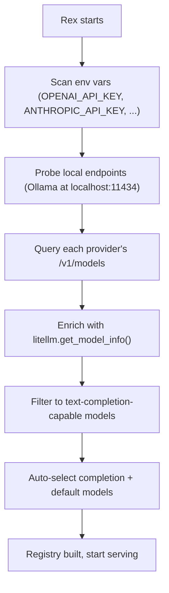

# Phase 0 — Proxy + Basic Routing

For the full delivery plan, see [ROADMAP.md](../../ROADMAP.md). For system design and routing strategy, see [ARCHITECTURE.md](../../ARCHITECTURE.md).

---

## Goal

- Build an OpenAI-compatible proxy that routes requests across multiple model backends.
- Automatically discover available models from environment variables and provider APIs — zero configuration required.
- Detect whether a request is a tab completion or a chat/agent interaction.
- Route all tasks to the cheapest model. The fallback chain escalates to more expensive models on failure.
- Fall back to the next available model if the primary fails.
- Validate end-to-end integration with AI coding tools (streaming, request formats, connectivity).

---

## Model Discovery

Rex discovers available models automatically at startup. No configuration file is required.



### Provider Detection

Rex scans environment variables for known API keys:

| Environment Variable | Provider |
|---|---|
| `OPENAI_API_KEY` | OpenAI |
| `ANTHROPIC_API_KEY` | Anthropic |
| `GROQ_API_KEY` | Groq |
| `GEMINI_API_KEY` | Gemini |
| `XAI_API_KEY` | xAI |
| `TOGETHERAI_API_KEY` | Together AI |
| `MISTRAL_API_KEY` | Mistral |
| `COHERE_API_KEY` | Cohere |

Rex also probes well-known local endpoints:
- Ollama at `http://localhost:11434`

### Model Listing

For each detected provider, Rex queries the provider's model listing API to get all available models.

### Metadata Enrichment

Rex calls `litellm.get_model_info()` for each discovered model to get:
- Context window (max tokens)
- Input/output cost per token
- Capabilities (supports vision, function calling, etc.)

For models not in LiteLLM's database (custom/private), Rex uses them without metadata — zero cost assumed, unknown context window.

### Auto-Routing

Rex selects the cheapest available model (prefers local, then lowest cloud cost) as the primary model for all tasks. The fallback chain orders remaining models by ascending cost, so failures escalate to progressively more capable models.

When only one model is discovered, it handles everything.

## Config Schema (Optional)

Rex works without a config file. When present, `config.yaml` acts as an override mechanism.

```yaml
server:
  host: "0.0.0.0"
  port: 9000

models:
  - name: "my-company/custom-model"
    api_base: "https://internal.company.com/v1"
    api_key: "sk-..."

routing:
  primary_model: "ollama/llama3"
```

### Server

| Field | Type | Required | Default | Description |
|---|---|---|---|---|
| `server.host` | string | no | `0.0.0.0` | Address Rex listens on |
| `server.port` | integer | no | `8000` | Port Rex listens on |

### Models

Manually defined models are merged with discovered models. A manual entry with the same name as a discovered model overrides it.

| Field | Type | Required | Description |
|---|---|---|---|
| `name` | string | yes | LiteLLM model identifier (e.g., `openai/gpt-4o`, `ollama/llama3`) |
| `api_key` | string | no | API key for this model's provider (overrides env var) |
| `api_base` | string | no | Override the provider's default API URL |

### Routing

| Field | Type | Required | Description |
|---|---|---|---|
| `routing.primary_model` | string | no | Override which model handles all tasks (default: auto-selected cheapest) |

- LiteLLM infers the provider from the model identifier prefix (e.g., `openai/` → OpenAI, `ollama/` → Ollama).
- When `routing` is omitted, Rex uses the cheapest discovered model as primary. The fallback chain orders remaining models by ascending cost.

---

## Model Registry

- Rex populates the registry from model discovery results, merged with any manual config overrides.
- Each model entry becomes a `ModelConfig` Pydantic model with fields: `name`, `api_key`, `api_base`.
- The registry provides lookups by name and listing all models.

---

## Feature Detection

Rex detects whether a request is a **tab completion** or a **chat/agent** interaction based on request signals:

| Signal | Completion | Chat/Agent |
|---|---|---|
| Conversation length | Single turn (1 user message) | Multi-turn (2+ messages) |
| Prompt length | Short (< 200 tokens) | Longer |
| System prompt | Contains code context / cursor position | General instructions |
| `max_tokens` | Low (< 500) | Higher or unset |
| `temperature` | Low (0-0.2) | Higher or unset |

- The detector examines the request and returns a feature type: `completion` or `chat`.
- Phase 0 uses a simple scoring approach: each signal contributes a weighted score, and the highest-scoring feature type wins.
- If the score is too close to call, the detector defaults to `chat` (the safer option — uses the model with adequate context for multi-turn).

### Routing Logic

```
model = cheapest_model  # or override from config
# fallback chain escalates to more expensive models on failure
```

---

## Fallback Chain

If the primary model fails (connection error, timeout, rate limit), Rex escalates to the next model by ascending cost:

1. Try the primary model (cheapest).
2. On failure, try the next cheapest model in the registry.
3. Continue up the cost ladder until a model succeeds.
4. If all models fail, return the error from the last attempt to the client.

- Rex logs each fallback attempt (which model failed, why, which model it fell back to).
- The fallback chain adds no overhead on the happy path — it only activates on failure.

---

## Endpoints

### POST /v1/chat/completions

- Accepts the full OpenAI chat completions request body.
- Runs feature detection on the request to determine `completion` vs. `chat`.
- Selects the model based on the routing logic and ignores the `model` field from the request.
- Passes all other parameters through to LiteLLM (`messages`, `temperature`, `max_tokens`, `top_p`, `stop`, `stream`, etc.).

**Non-streaming** (`stream: false` or omitted):

- Calls `await litellm.acompletion(model=selected_model, **params)`.
- Returns the response as JSON with `Content-Type: application/json`.

**Streaming** (`stream: true`):

- Calls `await litellm.acompletion(model=selected_model, stream=True, **params)`.
- Returns a `StreamingResponse` with `Content-Type: text/event-stream`.
- Each chunk: `data: {json}\n\n`
- Final signal: `data: [DONE]\n\n`

### POST /v1/completions

- Same pattern as chat completions but calls `await litellm.atext_completion()`.
- Supports both streaming and non-streaming modes.
- Always routes to the primary model (cheapest).

### GET /v1/models

- Returns all models from the registry in OpenAI's models list format:

```json
{
  "object": "list",
  "data": [
    {
      "id": "openai/gpt-4o",
      "object": "model",
      "created": 1700000000,
      "owned_by": "rex"
    },
    {
      "id": "ollama/llama3",
      "object": "model",
      "created": 1700000000,
      "owned_by": "rex"
    }
  ]
}
```

### GET /health

- Returns proxy status and model availability:

```json
{
  "status": "ok",
  "models": {
    "openai/gpt-4o": "available",
    "ollama/llama3": "unavailable"
  }
}
```

### Transparent Passthrough (catch-all)

- Catches any request to a path not handled above.
- Forwards the raw request (method, path, headers, query params, body) to the primary model's `api_base` via `httpx.AsyncClient`.
- Returns the upstream response as-is (status code, headers, body).
- If no `api_base` is configured for the default model, returns `501 Not Implemented`.

---

## SSE Streaming

The streaming response uses an async generator that yields OpenAI-compatible SSE events:

```python
async def stream_completion(response) -> AsyncIterator[str]:
    async for chunk in response:
        yield f"data: {chunk.model_dump_json()}\n\n"
    yield "data: [DONE]\n\n"
```

- FastAPI's `StreamingResponse` wraps this generator with `media_type="text/event-stream"`.
- LiteLLM's `acompletion(stream=True)` returns an async iterable of chunk objects.
- Each chunk follows the OpenAI `ChatCompletionChunk` schema (contains `id`, `choices` with `delta`, `finish_reason`).

---

## Error Handling

Rex follows the graceful degradation strategy from [ARCHITECTURE.md](../../ARCHITECTURE.md).

### LiteLLM Errors

| LiteLLM Exception | HTTP Status | Error Type |
|---|---|---|
| `AuthenticationError` | 401 | `authentication_error` |
| `RateLimitError` | 429 | `rate_limit_error` |
| `ServiceUnavailableError` | 503 | `service_unavailable` |
| `Timeout` | 504 | `timeout_error` |
| `BadRequestError` | 400 | `invalid_request_error` |
| Any other exception | 502 | `proxy_error` |

- Before returning an error to the client, Rex attempts the fallback chain.
- Rex only returns an error if all models in the fallback chain fail.
- All error responses use the OpenAI error format:

```json
{
  "error": {
    "message": "All model backends failed. Last error: ...",
    "type": "proxy_error",
    "code": 502
  }
}
```

### Request Validation

- FastAPI and Pydantic handle request validation automatically.
- Invalid request bodies return `422 Unprocessable Entity` with field-level error details.

### Startup Failures

- No providers detected and no config file → exit with a clear error listing the environment variables Rex looked for.
- Discovery finds zero models (e.g., all API keys invalid, all providers unreachable) → exit with error.
- Config exists but is invalid → exit with Pydantic validation errors.
- Config specifies a `routing.primary_model` that doesn't exist in the final registry (discovered + manual) → exit with `"Model '{name}' referenced in routing but not found"`.
- Provider API unreachable at startup → Rex skips that provider, logs a warning, continues with remaining providers.

---

## Project Files

Phase 0 creates only the files needed for a working proxy with basic routing:

```
app/
  main.py              # FastAPI app, lifespan, endpoint definitions
  config.py            # Pydantic Settings model, optional YAML loader
  discovery/
    providers.py       # Detects available providers from env vars
    models.py          # Queries provider APIs for available models
    metadata.py        # Enriches models with LiteLLM metadata
  proxy/
    handler.py         # Completion request handling via LiteLLM
    streaming.py       # SSE async generator
  router/
    registry.py        # Model registry + lookups
    detector.py        # Feature detection (completion vs. chat)
    engine.py          # Routing engine (detector -> model selection + fallback)
config.yaml.example   # Example configuration (optional overrides)
pyproject.toml         # Project dependencies (uv)
tests/                 # pytest test suite
```

### main.py

- Defines the FastAPI app with a lifespan context manager.
- Runs model discovery, optionally merges config overrides, and initializes the model registry at startup.
- Registers all endpoint routes.
- The catch-all route handles transparent passthrough.

### config.py

- `ModelConfig` Pydantic model for each model entry (`name`, `api_key`, `api_base`).
- `RoutingConfig` Pydantic model for optional routing overrides.
- `Settings` Pydantic model for the full config schema (all fields optional).
- `load_config(path: str) -> Settings | None` function that reads YAML if the file exists.

### discovery/providers.py

- Scans environment variables for known API keys.
- Probes local endpoints (Ollama).
- Returns a list of detected providers with their credentials.

### discovery/models.py

- Queries each detected provider's model listing API.
- Returns a list of available model names per provider.

### discovery/metadata.py

- Calls `litellm.get_model_info()` for each discovered model.
- Returns enriched model data (context window, pricing, capabilities).

### proxy/handler.py

- `handle_chat_completion(request, engine) -> Response` — runs feature detection, selects model, calls LiteLLM, returns JSON or streaming.
- `handle_text_completion(request, engine) -> Response` — routes to completion model, calls LiteLLM.
- `handle_passthrough(request, settings) -> Response` — forwards raw requests via httpx.

### proxy/streaming.py

- `stream_completion(response) -> AsyncIterator[str]` — the SSE async generator.

### router/registry.py

- `ModelRegistry` class populated from discovery results + config overrides.
- Lookups: `get_by_name(name)`, `get_all()`, `names()`.

### router/detector.py

- `detect_feature(request) -> FeatureType` — analyzes request signals, returns `completion` or `chat`.
- `FeatureType` enum: `COMPLETION`, `CHAT`.

### router/engine.py

- `RoutingEngine` class that combines detection + model selection + fallback.
- `route(request) -> ModelConfig` — detects feature type, selects model, handles fallback chain.

---

## Dependencies

```
fastapi>=0.115.0
uvicorn>=0.30.0
litellm>=1.40.0
pyyaml>=6.0
httpx>=0.27.0
```

| Dependency | Purpose |
|---|---|
| `fastapi` | HTTP server, request validation, streaming responses |
| `uvicorn` | ASGI server to run FastAPI |
| `litellm` | Unified interface to model backends (100+ providers) |
| `pyyaml` | Config file parsing |
| `httpx` | Async HTTP client for transparent passthrough |

---

## Verification

### Basic Connectivity

1. Set at least one provider API key:
   ```bash
   export OPENAI_API_KEY="sk-..."
   ```
2. Start Rex:
   ```bash
   uv run uvicorn app.main:app --host 0.0.0.0 --port 8000
   ```
3. Test health:
   ```bash
   curl http://localhost:8000/health
   ```
4. Test models list (should show discovered models):
   ```bash
   curl http://localhost:8000/v1/models
   ```

### Completion Routing

5. Send a short single-turn request (should route to cheapest model):
   ```bash
   curl -X POST http://localhost:8000/v1/chat/completions \
     -H "Content-Type: application/json" \
     -d '{"messages": [{"role": "user", "content": "complete: def hello"}], "max_tokens": 50, "temperature": 0}'
   ```
6. Send a multi-turn chat request (should route to cheapest model, same as completion):
   ```bash
   curl -X POST http://localhost:8000/v1/chat/completions \
     -H "Content-Type: application/json" \
     -d '{"messages": [{"role": "system", "content": "You are a helpful assistant"}, {"role": "user", "content": "Explain how async works in Python"}, {"role": "assistant", "content": "..."}, {"role": "user", "content": "Show me an example with aiohttp"}]}'
   ```

### Streaming

7. Test streaming with a chat request:
   ```bash
   curl -X POST http://localhost:8000/v1/chat/completions \
     -H "Content-Type: application/json" \
     -d '{"messages": [{"role": "user", "content": "Hello"}], "stream": true}'
   ```
   - Verify SSE chunks arrive incrementally, each prefixed with `data: `.
   - Verify the stream ends with `data: [DONE]\n\n`.

### Fallback

8. Configure a model with an invalid API key or unreachable `api_base`.
   - Send a request that routes to the broken model.
   - Verify Rex falls back to the next model and returns a valid response.

### Client Integration

9. Configure a coding tool to use `http://localhost:8000` as the API base URL.
   - Send a tab completion and verify the cheapest model responds.
   - Send a chat message and verify the cheapest model responds (or fallback if it fails).
