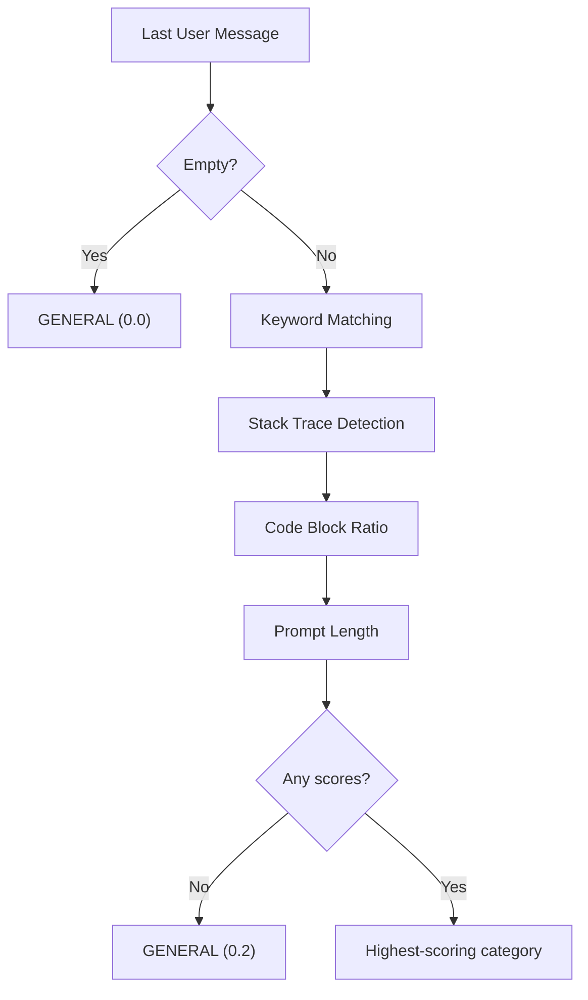

# Phase 1 — Heuristic Task Classifier

For the full delivery plan, see [ROADMAP.md](../../ROADMAP.md). For system design and routing strategy, see [ARCHITECTURE.md](../../ARCHITECTURE.md).

---

## Goal

- Classify chat/agent prompts by coding task type using fast pattern-based heuristics.
- Map each task category to routing requirements (context window, capabilities) so the routing engine selects the cheapest model that fits.
- Provide a client adapter interface that normalizes tool-specific request patterns into a common format for the classifier.

---

## Task Categories

The classifier uses 11 predefined categories:

| Category | Description |
|---|---|
| `completion` | Tab completion / short code insertion (assigned by feature detection, not by the classifier) |
| `debugging` | Fixing errors, stack traces, crashes |
| `refactoring` | Restructuring, simplifying, extracting |
| `optimization` | Performance, memory, speed improvements |
| `test_generation` | Writing or adding tests |
| `explanation` | Explaining code behavior |
| `documentation` | Docstrings, READMEs, API docs |
| `code_review` | Reviewing code for correctness, security |
| `generation` | Writing new code from description |
| `migration` | Upgrading, converting, porting between technologies |
| `general` | Fallback when no category matches |

### TaskCategory

```python
class TaskCategory(str, Enum):
    COMPLETION = "completion"
    DEBUGGING = "debugging"
    REFACTORING = "refactoring"
    OPTIMIZATION = "optimization"
    TEST_GENERATION = "test_generation"
    EXPLANATION = "explanation"
    DOCUMENTATION = "documentation"
    CODE_REVIEW = "code_review"
    GENERATION = "generation"
    MIGRATION = "migration"
    GENERAL = "general"
```

---

## Routing Requirements

Each category maps to a static set of routing requirements. The engine uses these requirements to filter the model registry and select the cheapest model that qualifies.

| Category | `min_context_window` | `needs_reasoning` |
|---|---|---|
| `completion` | — | — |
| `debugging` | — | yes |
| `refactoring` | 32,000 | — |
| `optimization` | — | yes |
| `test_generation` | 16,000 | — |
| `explanation` | — | — |
| `documentation` | 16,000 | — |
| `code_review` | 32,000 | yes |
| `generation` | 16,000 | — |
| `migration` | 32,000 | yes |
| `general` | — | — |

- `needs_function_calling` and `needs_cloud` exist in `TaskRequirements` but no category currently sets them to `True`.

### Rationale

Each requirement targets capabilities that a model must have to avoid near-certain failure on the task. Requirements are the minimum bar — if a model fails despite meeting them, the fallback chain escalates.

| Category | Requirements | Why |
|---|---|---|
| `completion` | none | Tab completion is short code insertion. Any model handles it. |
| `debugging` | `needs_reasoning` | Debugging requires tracing control flow, correlating error messages with code logic, and understanding side effects. Non-reasoning models frequently miss root causes. Code reasoning complexity (execution traces, control flow) is a top differentiator between model tiers ([CodeGlance, 2026](https://arxiv.org/abs/2602.13962)). |
| `refactoring` | `min_context_window=32k` | Refactoring requires visibility into class hierarchies, call sites, and dependencies across files. A model that can only see a fraction of the affected code produces incomplete or inconsistent changes. |
| `optimization` | `needs_reasoning` | Performance optimization requires analyzing algorithmic complexity, memory patterns, and profiling data. Even reasoning models achieve only 4.8% accuracy generating code under specific complexity constraints ([BigO(Bench), 2025](https://arxiv.org/abs/2503.15242)). Non-reasoning models perform substantially worse. |
| `test_generation` | `min_context_window=16k` | Tests need to see the implementation being tested, existing test patterns, and fixtures. 16k context covers most single-module test scenarios. |
| `explanation` | none | Explanation ranges from trivial ("what does `len()` do?") to complex. The cheap-first strategy with fallback escalation handles this range — simple explanations stay cheap, complex ones escalate on failure. |
| `documentation` | `min_context_window=16k` | Writing documentation requires seeing the code being documented — function signatures, class hierarchies, module structure. Small models generate good function-level docstrings, but file-level documentation quality drops significantly without sufficient context ([comparative analysis of LLMs for code documentation, 2024](https://arxiv.org/abs/2312.10349)). 16k covers function-level and most file-level documentation scenarios. |
| `code_review` | `min_context_window=32k`, `needs_reasoning` | Review requires seeing a large diff (context) and reasoning about correctness, security, and edge cases. Both requirements are necessary — context alone is insufficient without the ability to reason about what the code does. |
| `generation` | `min_context_window=16k` | Code generation from descriptions needs surrounding codebase context (imports, types, APIs) to produce code that fits the project. |
| `migration` | `min_context_window=32k`, `needs_reasoning` | Migration requires reasoning about API differences, mapping deprecated patterns to new ones, and handling breaking changes. It also requires large context to see enough of the codebase for consistent migration. [CodeMEnv (2025)](https://arxiv.org/abs/2506.00894) shows that model capability (reasoning ability) — not deployment location (cloud vs local) — determines migration success. [Google's migration study (2025)](https://arxiv.org/abs/2504.09691) confirms the same at enterprise scale. |
| `general` | none | Catch-all fallback. Cheap-first with escalation on failure. |

### TaskRequirements

```python
@dataclass(frozen=True)
class TaskRequirements:
    min_context_window: int | None = None
    needs_function_calling: bool = False
    needs_reasoning: bool = False
    needs_cloud: bool = False
```

---

## Heuristic Classifier

The classifier analyzes the **last user message** in the conversation and produces a `ClassificationResult`:

```python
@dataclass(frozen=True)
class ClassificationResult:
    category: TaskCategory
    confidence: float
    scores: dict[TaskCategory, float] = field(default_factory=dict)
```

### Classification Flow



### Signal 1: Keyword Matching

The classifier checks the last user message against keyword patterns for each category. Each pattern is a case-insensitive regex with word boundaries:

| Category | Keywords |
|---|---|
| `debugging` | error, bug, fix, crash, traceback, exception, stack trace, segfault, failing |
| `refactoring` | refactor, clean up, simplify, restructure, reorganize, extract method/function/class |
| `optimization` | faster, performance, optimize, memory, efficient, speed up, slow, bottleneck, profil |
| `test_generation` | write test(s), add test(s), unit test(s), test case(s), spec, coverage, pytest, jest |
| `explanation` | explain, what does, how does, why does/is/do, walk me through, what is |
| `documentation` | document, docstring, readme, api doc(s), jsdoc, comment, changelog |
| `code_review` | review, is this correct, what's wrong, security, vulnerability, audit |
| `generation` | create, implement, build, write, generate, scaffold, boilerplate, add a |
| `migration` | upgrade, migrate, convert to, update from, port to, switch from |

- `completion` and `general` have no keyword patterns.
- Each keyword match contributes to the category's score: `0.4` base + `0.2` per match, capped at `1.0`.

### Signal 2: Stack Trace Detection

The classifier detects stack traces using a multiline regex that matches common patterns:

- `Traceback (most recent call last)`
- `at ... (file:line:col)` (JavaScript-style)
- `File "...", line N` (Python-style)
- Lines starting with `at ` (Java/Node-style)

If a stack trace is found, the classifier adds `+0.3` to the `debugging` score.

### Signal 3: Code Block Ratio

The classifier computes the ratio of text inside fenced code blocks (` ``` `) to total text length.

- If `code_ratio > 0.3`: add `+0.1` to every scored category in the "code-heavy" set.
- Code-heavy categories: `debugging`, `refactoring`, `optimization`, `test_generation`, `code_review`, `generation`.

### Signal 4: Prompt Length

- If `len(text) > 500`: add `+0.1` to every scored category in the "long context" set.
- Long context categories: `refactoring`, `code_review`, `generation`, `test_generation`.

### Scoring Summary

| Signal | Effect | Conditions |
|---|---|---|
| Keyword match | `score = 0.4 + count * 0.2` (cap 1.0) | Per category, count = total regex matches |
| Stack trace | `debugging += 0.3` | Stack trace pattern found |
| Code-heavy | `category += 0.1` | Code ratio > 0.3, category already scored and in code-heavy set |
| Long prompt | `category += 0.1` | Prompt > 500 chars, category already scored and in long-context set |

### Tie-Breaking

When multiple categories have the same score, the classifier uses a fixed priority order:

1. `debugging`
2. `test_generation`
3. `refactoring`
4. `code_review`
5. `optimization`
6. `migration`
7. `explanation`
8. `documentation`
9. `generation`

### Confidence Levels

| Confidence | Condition |
|---|---|
| `0.0` | Empty message |
| `0.2` | No keyword matches (GENERAL fallback) |
| `0.6` | One keyword match |
| `0.7` | One keyword match + structural signal (code-heavy or long prompt) |
| `0.8+` | Two or more keyword matches |

---

## Client Adapter Interface

The adapter layer normalizes tool-specific request patterns into a common format before classification. Each supported tool (Cursor, Claude Code, etc.) has its own adapter that detects features like tab completion vs. chat.

### NormalizedRequest

```python
@dataclass(frozen=True)
class NormalizedRequest:
    messages: list[dict]
    feature_type: FeatureType
    max_tokens: int | None = None
    temperature: float | None = None
```

### ClientAdapter (ABC)

```python
class ClientAdapter(ABC):
    @abstractmethod
    def normalize(
        self,
        messages: list[dict],
        max_tokens: int | None = None,
        temperature: float | None = None,
    ) -> NormalizedRequest: ...
```

### DefaultAdapter

The default adapter passes messages through unchanged and delegates feature detection to the scoring heuristic in `detector.py`:

- Calls `detect_feature(messages, max_tokens, temperature)` to determine `FeatureType` (`COMPLETION` or `CHAT`).
- Returns `NormalizedRequest(messages=messages, feature_type=feature, max_tokens=max_tokens, temperature=temperature)`.

### AdapterRegistry

```python
class AdapterRegistry:
    def register(self, user_agent_prefix: str, adapter: ClientAdapter) -> None: ...
    def get_adapter(self, user_agent: str | None) -> ClientAdapter: ...
```

- `register()` stores an adapter keyed by `user_agent_prefix.lower()`.
- `get_adapter()` iterates registered prefixes and returns the first adapter whose prefix appears as a substring of the `User-Agent` header (case-insensitive).
- If no registered prefix matches or `User-Agent` is empty, returns the `DefaultAdapter`.

### Integration

The chat completion handler:

1. Reads `User-Agent` from the request.
2. `AdapterRegistry.get_adapter(user_agent)` selects the adapter.
3. The adapter normalizes the request → `NormalizedRequest`.
4. The engine uses `normalized.feature_type` for routing: `COMPLETION` skips classification, `CHAT` triggers the heuristic classifier.

---

## Orthogonality of Feature Type and Task Category

`FeatureType` and `TaskCategory` are independent classifications:

| Classification | Determines | Set by |
|---|---|---|
| `FeatureType` (COMPLETION / CHAT) | Whether to classify the task at all | Client adapter via detector |
| `TaskCategory` (11 categories) | Which routing requirements to apply | Heuristic classifier (chat only) |

- The adapter sets `FeatureType`. The classifier sets `TaskCategory`.
- Tab completions (`COMPLETION`) skip the classifier entirely and route to the primary model.
- Chat requests go through the classifier to determine the task category and its routing requirements.

---

## Project Files

Phase 1 adds the classifier and adapter modules:

```
app/
  router/
    categories.py        # TaskCategory enum, TaskRequirements, CATEGORY_REQUIREMENTS map
    classifier.py        # Heuristic task classifier (keyword + structural)
  adapters/
    base.py              # ClientAdapter ABC and NormalizedRequest
    default.py           # Default adapter (generic feature detection)
    registry.py          # Selects adapter by User-Agent header
```

### router/categories.py

- `TaskCategory` string enum with 11 categories.
- `TaskRequirements` frozen dataclass with `min_context_window`, `needs_function_calling`, `needs_reasoning`, `needs_cloud`.
- `CATEGORY_REQUIREMENTS` dict mapping each category to its requirements.
- `get_requirements(category) -> TaskRequirements`: direct lookup.

### router/classifier.py

- `_KEYWORD_PATTERNS`: regex patterns per category.
- `_CATEGORY_PRIORITY`: tie-break ordering.
- `_STACK_TRACE_PATTERN`: multiline regex for stack trace detection.
- `_CODE_BLOCK_PATTERN`: fenced code block regex.
- `_CODE_HEAVY_CATEGORIES` and `_LONG_CONTEXT_CATEGORIES`: frozensets.
- `ClassificationResult` frozen dataclass with `category`, `confidence`, `scores`.
- `classify(messages) -> ClassificationResult`: the main classification function.
- `_extract_last_user_message()`, `_has_stack_trace()`, `_code_block_ratio()`, `_count_keyword_matches()`: private helpers.

### adapters/base.py

- `NormalizedRequest` frozen dataclass.
- `ClientAdapter` abstract base class with `normalize()`.

### adapters/default.py

- `DefaultAdapter(ClientAdapter)`: passes messages through, delegates feature detection to `detect_feature()`.

### adapters/registry.py

- `AdapterRegistry`: substring-based adapter selection from `User-Agent` header.

---

## Verification

### Keyword Classification

1. Send a request with debugging keywords:
   ```bash
   curl -X POST http://localhost:8000/v1/chat/completions \
     -H "Content-Type: application/json" \
     -d '{"messages": [{"role": "user", "content": "Fix this error: TypeError: undefined is not a function"}]}'
   ```
2. Check logs for classification: category `debugging`, confidence `0.6+`.

### Stack Trace Boost

3. Send a request with a Python stack trace:
   ```bash
   curl -X POST http://localhost:8000/v1/chat/completions \
     -H "Content-Type: application/json" \
     -d '{"messages": [{"role": "user", "content": "What is happening here?\nTraceback (most recent call last):\n  File \"app.py\", line 10, in main\n    raise ValueError(\"bad input\")"}]}'
   ```
4. Verify the `debugging` score includes the `+0.3` stack trace boost.

### General Fallback

5. Send a request with no recognizable keywords:
   ```bash
   curl -X POST http://localhost:8000/v1/chat/completions \
     -H "Content-Type: application/json" \
     -d '{"messages": [{"role": "user", "content": "Tell me about distributed systems"}]}'
   ```
6. Verify the classification falls back to `general` with confidence `0.2`.

### Feature Detection

7. Send a short, single-turn request with `max_tokens: 50` and `temperature: 0`:
   ```bash
   curl -X POST http://localhost:8000/v1/chat/completions \
     -H "Content-Type: application/json" \
     -d '{"messages": [{"role": "user", "content": "def fibonacci(n):"}], "max_tokens": 50, "temperature": 0}'
   ```
8. Verify the request is detected as `COMPLETION` and routed to the primary model without classification.

### Task-Aware Routing

9. With multiple models available (e.g., one with `supports_reasoning=True` and one without):
10. Send a debugging request.
11. Verify the engine selects a model with `supports_reasoning=True` (or the cheapest model that supports it).

### Client Adapter

12. Register a custom adapter for a specific `User-Agent`.
13. Send a request with that `User-Agent`.
14. Verify the adapter's `normalize()` method is called instead of the default.
