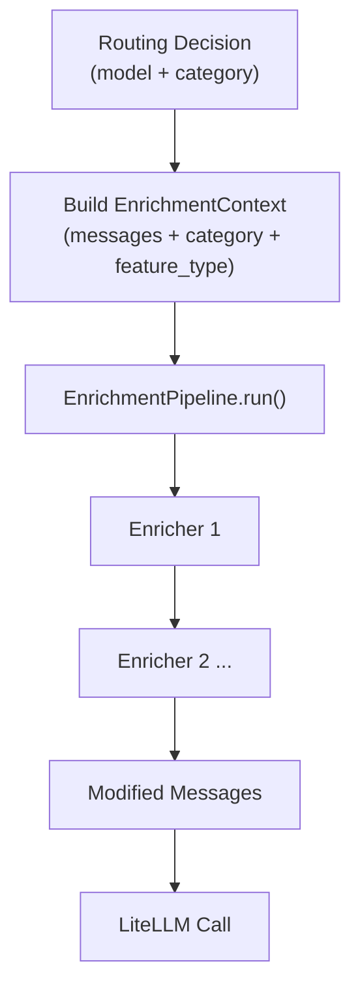

# Phase 2 — Enrichment Pipeline

For the full delivery plan, see [ROADMAP.md](../../ROADMAP.md). For system design and routing strategy, see [ARCHITECTURE.md](../../ARCHITECTURE.md).

---

## Goal

- Build a pluggable pipeline that transforms requests after routing but before the model call.
- The first enricher injects task decomposition instructions for complex tasks, replicating structured step-by-step execution across all models.
- The pipeline only applies to `chat` requests — `completion` requests (tab completions) skip it entirely.
- Each enricher is opt-in. When no enrichers are enabled, the pipeline is a no-op with zero overhead.

---

## Pipeline Architecture

The enrichment pipeline sits between the routing decision and the LiteLLM call:



- Enrichers run in sequence. Each enricher receives the output of the previous one.
- If an enricher raises an exception, the pipeline logs the error and continues with the unchanged context.
- The pipeline uses a copy of the original request messages, not the adapter-normalized messages.

---

## EnrichmentContext

The context object carries the request data through the pipeline:

```python
@dataclass
class EnrichmentContext:
    messages: list[dict] = field(default_factory=list)
    category: TaskCategory = TaskCategory.GENERAL
    confidence: float = 0.0
    feature_type: FeatureType = FeatureType.CHAT
```

| Field | Source |
|---|---|
| `messages` | Shallow copy of the original request body's `messages` |
| `category` | From `RoutingDecision.category` |
| `confidence` | From `RoutingDecision.confidence` |
| `feature_type` | From `RoutingDecision.feature_type` |

---

## Enricher Protocol

```python
class Enricher(Protocol):
    def enrich(self, context: EnrichmentContext) -> EnrichmentContext: ...
```

- Any object with an `enrich(context) -> EnrichmentContext` method satisfies the protocol.
- The enricher may modify `context.messages` in place or return a new context.

---

## EnrichmentPipeline

```python
class EnrichmentPipeline:
    def __init__(self, enrichers: list[Enricher]) -> None: ...
    def run(self, context: EnrichmentContext) -> EnrichmentContext: ...
```

- `run()` calls `enricher.enrich(context)` for each enricher in order.
- If an enricher raises an exception, the pipeline logs the error with `logger.exception()` and continues with the previous context (the failed enricher's modifications are discarded).
- If the enricher list is empty, `run()` returns the context unchanged.

---

## Task Decomposition Enricher

The first (and currently only) enricher. When enabled, it detects complex tasks and injects a system-level instruction telling the model to break the task into steps.

### Complexity Detection

The enricher uses the task category from the routing decision to determine complexity:

```python
COMPLEX_CATEGORIES = frozenset({
    TaskCategory.GENERATION,
    TaskCategory.REFACTORING,
    TaskCategory.MIGRATION,
    TaskCategory.CODE_REVIEW,
    TaskCategory.TEST_GENERATION,
    TaskCategory.DOCUMENTATION,
})
```

A task is complex when **both** conditions hold:

1. `feature_type == FeatureType.CHAT`
2. `category in COMPLEX_CATEGORIES`

| Trigger (enrichment applies) | Skip (no enrichment) |
|---|---|
| `generation` | `completion` |
| `refactoring` | `debugging` |
| `migration` | `optimization` |
| `code_review` | `explanation` |
| `test_generation` | `general` |
| `documentation` | Any category with `feature_type != CHAT` |

- `confidence` plays no role in the complexity decision.
- Prompt length, code block ratio, and other structural signals do not affect complexity — only the category and feature type matter.

### Decomposition Instruction

The enricher injects this text:

```
Before starting, break this task into a numbered list of concrete subtasks. Work through each subtask one at a time. State which subtask you are working on and mark it done before moving to the next.
```

### Injection Logic

1. If the task is not complex → return the context unchanged.
2. Iterate through `context.messages` in order.
3. On the **first** message with `role == "system"`:
   - Append `"\n\n" + DECOMPOSITION_INSTRUCTION` to the existing `content`.
   - Return immediately (only the first system message is modified).
4. If **no** system message exists:
   - Insert `{"role": "system", "content": DECOMPOSITION_INSTRUCTION}` at index 0.
   - Return.

- The enricher never replaces existing system content — it always appends.
- If multiple system messages exist, only the first one is modified.

---

## Pipeline Construction

```python
def build_pipeline(settings: Settings) -> EnrichmentPipeline:
```

- Checks `settings.enrichments.task_decomposition`.
- If `True`, adds `TaskDecompositionEnricher()` to the enricher list.
- Returns `EnrichmentPipeline(enrichers)`.

---

## Handler Integration

The chat completion handler wires the pipeline:

1. The routing engine produces a `RoutingDecision` (model, category, confidence, feature_type).
2. If the pipeline is available:
   - Build an `EnrichmentContext` from the original request body messages (shallow copy) and the routing decision fields.
   - Call `pipeline.run(context)`.
   - Replace the request body messages with the enriched messages.
3. The LiteLLM call uses the enriched messages.

- The `/v1/completions` endpoint does not receive or run the enrichment pipeline.
- The `/v1/chat/completions` endpoint always passes the pipeline (even when it has zero enrichers — `run()` is a no-op).

---

## Config Schema

Add an `enrichments` section to the config:

```yaml
enrichments:
  task_decomposition: true
```

### EnrichmentsConfig

| Field | Type | Required | Default | Description |
|---|---|---|---|---|
| `enrichments.task_decomposition` | boolean | no | `false` | Enable the task decomposition enricher |

### Settings Extension

```python
class EnrichmentsConfig(BaseModel):
    task_decomposition: bool = False

class Settings(BaseModel):
    server: ServerConfig = ServerConfig()
    models: list[ModelConfig] = []
    routing: RoutingConfig = RoutingConfig()
    enrichments: EnrichmentsConfig = EnrichmentsConfig()
```

---

## Project Files

Phase 2 adds the enrichment module:

```
app/
  enrichment/
    context.py             # EnrichmentContext dataclass
    pipeline.py            # Enricher protocol, EnrichmentPipeline, build_pipeline
    task_decomposition.py  # Task decomposition enricher
  proxy/
    handler.py             # Build EnrichmentContext, run pipeline before LiteLLM call
  main.py                  # Initialize pipeline via build_pipeline(settings)
  config.py                # Add EnrichmentsConfig, extend Settings
```

### enrichment/context.py

- `EnrichmentContext` dataclass: `messages`, `category`, `confidence`, `feature_type`.

### enrichment/pipeline.py

- `Enricher` structural protocol with `enrich()` method.
- `EnrichmentPipeline` class: sequential execution with exception safety.
- `build_pipeline(settings) -> EnrichmentPipeline`: reads config flags and assembles the enricher list.

### enrichment/task_decomposition.py

- `COMPLEX_CATEGORIES` frozenset: the six categories that trigger decomposition.
- `DECOMPOSITION_INSTRUCTION` constant: the injected system text.
- `_is_complex(context) -> bool`: checks feature type and category.
- `TaskDecompositionEnricher` class: implements `Enricher` protocol.

### proxy/handler.py (modified)

- `handle_chat_completion` accepts an optional `EnrichmentPipeline`.
- After routing, builds `EnrichmentContext` and runs the pipeline.
- Replaces request body messages with enriched messages.

### main.py (modified)

- Lifespan calls `build_pipeline(settings)` and stores the pipeline globally.
- Passes the pipeline to `handle_chat_completion`.

### config.py (modified)

- `EnrichmentsConfig` Pydantic model with `task_decomposition: bool = False`.
- `Settings` gains `enrichments: EnrichmentsConfig = EnrichmentsConfig()`.

---

## Verification

### Task Decomposition Triggers

1. Enable task decomposition in config:
   ```yaml
   enrichments:
     task_decomposition: true
   ```
2. Send a generation request:
   ```bash
   curl -X POST http://localhost:8000/v1/chat/completions \
     -H "Content-Type: application/json" \
     -d '{"messages": [{"role": "system", "content": "You are a helpful assistant."}, {"role": "user", "content": "Build a REST API with authentication and rate limiting"}]}'
   ```
3. Verify the system message sent to the model includes the decomposition instruction appended after the original content.

### Simple Tasks Skip Enrichment

4. Send a debugging request (not in `COMPLEX_CATEGORIES`):
   ```bash
   curl -X POST http://localhost:8000/v1/chat/completions \
     -H "Content-Type: application/json" \
     -d '{"messages": [{"role": "user", "content": "Fix this error: NameError: name x is not defined"}]}'
   ```
5. Verify the messages sent to the model are unchanged (no decomposition instruction).

### No System Message

6. Send a complex request without a system message:
   ```bash
   curl -X POST http://localhost:8000/v1/chat/completions \
     -H "Content-Type: application/json" \
     -d '{"messages": [{"role": "user", "content": "Refactor this class to use dependency injection"}]}'
   ```
7. Verify the enricher inserts a system message at index 0 with the decomposition instruction.

### Completions Skip Pipeline

8. Send a request to `/v1/completions`:
   ```bash
   curl -X POST http://localhost:8000/v1/completions \
     -H "Content-Type: application/json" \
     -d '{"prompt": "def hello():", "max_tokens": 50}'
   ```
9. Verify no enrichment is applied.

### Pipeline Disabled

10. Set `enrichments.task_decomposition: false` (or omit the config entirely).
11. Send a complex request.
12. Verify the messages are unchanged.

### Enricher Error Safety

13. Register a custom enricher that raises an exception.
14. Verify the pipeline logs the error and continues with the unchanged context.
15. Verify the request completes successfully.
