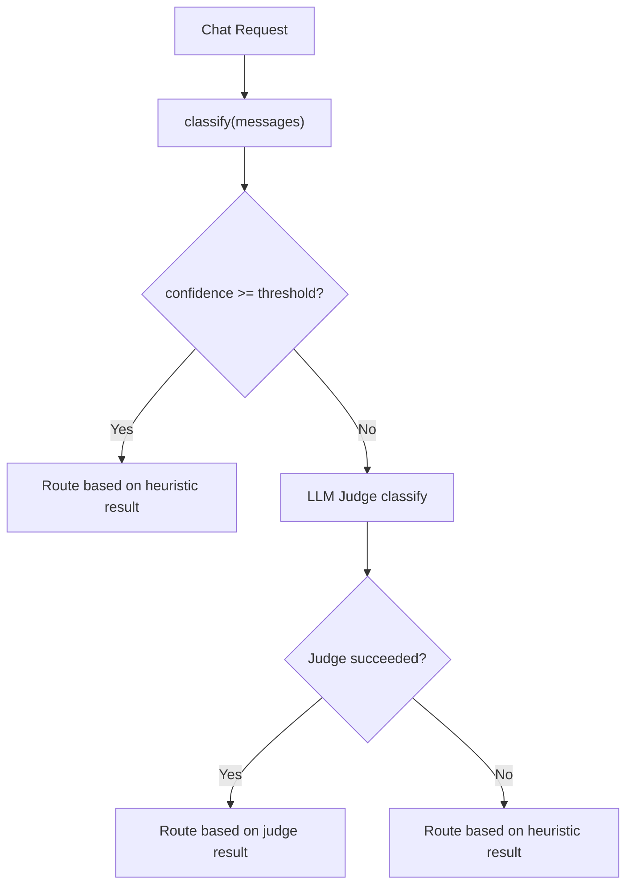

# Phase 3 — LLM-as-Judge Fallback

For the full delivery plan, see [ROADMAP.md](../../ROADMAP.md). For system design and routing strategy, see [ARCHITECTURE.md](../../ARCHITECTURE.md).

---

## Goal

- Use a small local LLM to classify tasks when heuristic confidence is low ([Zheng et al., 2023](https://arxiv.org/abs/2306.05685)).
- The judge provides a second opinion when keyword-based heuristics fail to identify the task type.
- Only triggered for `chat` requests — completions skip it entirely.
- Graceful degradation: if the judge fails, the router falls back to the heuristic result.

---

## Classifier Chain Integration

The engine evaluates classifiers in order and stops at the first confident result:

1. **Heuristics** (`classify(messages)`) — keyword matching, structural analysis (<1ms).
2. **LLM judge** — triggered only when heuristic confidence falls below the threshold.

The judge slot sits between heuristics and the future ML classifier (Phase 5). When the ML classifier is added later, the chain becomes: heuristics → ML classifier → LLM judge.



---

## Confidence Threshold

- The engine triggers the judge when heuristic confidence falls below `confidence_threshold` (default: `0.5`).
- The heuristic classifier produces these confidence levels:

| Confidence | Condition |
|---|---|
| `0.0` | Empty message |
| `0.2` | No keyword matches (GENERAL fallback) |
| `0.6` | One keyword match |
| `0.7` | One keyword match + structural signal (code-heavy or long prompt) |
| `0.8+` | Two or more keyword matches |

- With the default threshold of `0.5`, the judge triggers only for GENERAL fallback cases where no keywords matched.
- The threshold is configurable to allow tighter or looser triggering.

---

## Judge Model Selection

- The judge uses a small, fast model to minimize latency.
- The user can specify the model via `routing.judge.model` in config.
- When no model is specified, the engine auto-selects the cheapest local model from the registry.
- If no local model is available and no model is specified, the engine disables the judge and logs a warning.
- The judge model does not need to be separate from the routing registry — it can be any model Rex knows about.

---

## Classification Meta-Prompt

The judge receives a system prompt and the user's last message, then returns a structured JSON classification.

### System Prompt

```
You are a task classifier for a coding assistant. Classify the user's request into exactly one category.

Categories:
- debugging: fixing errors, bugs, crashes, exceptions
- refactoring: restructuring or simplifying existing code
- optimization: improving performance, speed, memory usage
- test_generation: writing tests, test cases, specs
- explanation: explaining code, concepts, or behavior
- documentation: writing docs, docstrings, READMEs
- code_review: reviewing code for correctness, style, security
- generation: creating new code from a description
- migration: upgrading, converting, or porting code
- general: anything that does not fit the above

Respond with a JSON object:
{
  "category": "<category>",
  "confidence": <0.0-1.0>,
  "complexity": "<simple|complex>",
  "min_context_window": <integer or null>
}

Rules:
- "confidence" reflects how certain you are about the category.
- "complexity" is "complex" if the task involves multiple steps, files, or concerns; "simple" otherwise.
- "min_context_window" is the minimum context window (in tokens) the task requires. Use null if the default is sufficient.
- Respond ONLY with the JSON object, no other text.
```

### User Message

The judge receives only the last user message from the conversation — the same text the heuristic classifier analyzes.

### LiteLLM Call

```python
response = await litellm.acompletion(
    model=judge_model,
    messages=[
        {"role": "system", "content": JUDGE_SYSTEM_PROMPT},
        {"role": "user", "content": last_user_message},
    ],
    response_format={"type": "json_object"},
    max_tokens=150,
    temperature=0.0,
    timeout=timeout_seconds,
)
```

---

## Response Parsing

The judge parses the model's response as JSON and validates each field:

| Field | Type | Required | Validation |
|---|---|---|---|
| `category` | string | yes | Must be a valid `TaskCategory` value |
| `confidence` | float | yes | Must be between 0.0 and 1.0 |
| `complexity` | string | no | Must be `"simple"` or `"complex"` if present |
| `min_context_window` | integer | no | Must be positive if present |

- If JSON parsing fails, the judge returns `None` (fallback to heuristics).
- If a required field is missing or invalid, the judge returns `None`.
- Optional fields that are missing or invalid are ignored (defaults apply).

### JudgeResult

```python
@dataclass(frozen=True)
class JudgeResult:
    category: TaskCategory
    confidence: float
    complexity: str | None = None
    min_context_window: int | None = None
```

---

## How Judge Results Affect Routing

When the judge provides a result, the engine uses it for model selection:

- **`category`**: replaces the heuristic category in `RoutingDecision`.
- **`confidence`**: replaces the heuristic confidence.
- **`min_context_window`**: if provided, overrides the default `TaskRequirements.min_context_window` for the category.
- **`complexity`**: carried on `RoutingDecision` as an optional field. The enrichment pipeline uses it to override the category-based complexity check.

### RoutingDecision Extension

```python
@dataclass(frozen=True)
class RoutingDecision:
    model: ModelConfig
    category: TaskCategory
    confidence: float
    feature_type: FeatureType
    complexity_override: str | None = None
```

When `complexity_override` is set:
- `"complex"` → the enrichment pipeline treats the request as complex regardless of category.
- `"simple"` → the enrichment pipeline skips enrichment regardless of category.
- `None` → the pipeline uses the default category-based logic.

---

## Error Handling

The judge follows the graceful degradation strategy:

| Failure | Behavior |
|---|---|
| Model returns non-JSON | Log warning, return `None`, use heuristic result |
| JSON missing required fields | Log warning, return `None`, use heuristic result |
| Invalid category value | Log warning, return `None`, use heuristic result |
| LiteLLM timeout | Log warning, return `None`, use heuristic result |
| LiteLLM error (any) | Log warning, return `None`, use heuristic result |

- The judge never raises exceptions to the caller.
- All failures are logged at `WARNING` level with the error details.

---

## Latency Guard

- The judge only runs for `CHAT` feature type requests.
- `COMPLETION` requests skip the judge entirely (the engine routes them to primary without classification).
- Expected latency: 200–500ms for a small local model.
- The timeout (`timeout_seconds`, default: `5.0`) prevents the judge from blocking the request indefinitely.

---

## Config Schema

Add a `judge` section under `routing`:

```yaml
routing:
  primary_model: "ollama/llama3"
  judge:
    enabled: true
    model: "ollama/llama3.2:1b"
    confidence_threshold: 0.5
    timeout_seconds: 5.0
```

### JudgeConfig

| Field | Type | Required | Default | Description |
|---|---|---|---|---|
| `routing.judge.enabled` | boolean | no | `false` | Enable the LLM judge fallback |
| `routing.judge.model` | string | no | `null` | Model to use for judging. When null, auto-selects the cheapest local model. |
| `routing.judge.confidence_threshold` | float | no | `0.5` | Heuristic confidence below this triggers the judge |
| `routing.judge.timeout_seconds` | float | no | `5.0` | Maximum seconds to wait for the judge response |

### Settings Extension

```python
class JudgeConfig(BaseModel):
    enabled: bool = False
    model: str | None = None
    confidence_threshold: float = 0.5
    timeout_seconds: float = 5.0

class RoutingConfig(BaseModel):
    primary_model: str | None = None
    judge: JudgeConfig = JudgeConfig()
```

---

## Project Files

Phase 3 adds the judge module and modifies existing files:

```
app/
  config.py                # Add JudgeConfig, extend RoutingConfig
  router/
    llm_judge.py           # LLM judge classifier
    engine.py              # Integrate judge into select_model (becomes async)
  enrichment/
    context.py             # Add optional complexity_override field
    task_decomposition.py  # Respect complexity_override from EnrichmentContext
  proxy/
    handler.py             # Pass complexity_override to enrichment context
tests/
  test_llm_judge.py
  test_engine.py           # Updated for async select_model + judge integration
  test_task_decomposition.py # Updated for complexity_override
```

### router/llm_judge.py

- `JUDGE_SYSTEM_PROMPT` constant: the classification meta-prompt.
- `JudgeResult` frozen dataclass: `category`, `confidence`, `complexity`, `min_context_window`.
- `LLMJudge` class:
  - `__init__(model: str, timeout_seconds: float)`.
  - `async classify(last_user_message: str) -> JudgeResult | None`: calls LiteLLM, parses JSON, validates fields, returns `JudgeResult` or `None` on failure.
  - `_parse_response(content: str) -> JudgeResult | None`: JSON parsing and validation.

### router/engine.py (modified)

- `RoutingDecision` gains optional `complexity_override: str | None = None`.
- `select_model` becomes `async select_model`.
- After heuristic classification, if `feature == CHAT` and `result.confidence < threshold` and judge is available, calls `await judge.classify(last_user_message)`.
- If judge returns a result, the engine uses the judge's category and confidence. If the judge provides `min_context_window`, the engine builds custom `TaskRequirements` overriding the category default.
- `RoutingEngine.__init__` accepts optional `LLMJudge` instance and `confidence_threshold`.

### enrichment/context.py (modified)

- `EnrichmentContext` gains optional `complexity_override: str | None = None`.

### enrichment/task_decomposition.py (modified)

- `_is_complex` checks `context.complexity_override` first:
  - `"complex"` → returns `True` regardless of category.
  - `"simple"` → returns `False` regardless of category.
  - `None` → falls through to the existing category-based check.

### proxy/handler.py (modified)

- `handle_chat_completion` passes `decision.complexity_override` to `EnrichmentContext`.
- `await engine.select_model(...)` replaces the current synchronous call.

### config.py (modified)

- `JudgeConfig` Pydantic model with `enabled`, `model`, `confidence_threshold`, `timeout_seconds`.
- `RoutingConfig` gains `judge: JudgeConfig = JudgeConfig()`.

---

## Verification

### Judge Triggers on Low Confidence

1. Enable the judge in config:
   ```yaml
   routing:
     judge:
       enabled: true
   ```
2. Send a request with no obvious keywords (heuristics return GENERAL at 0.2):
   ```bash
   curl -X POST http://localhost:8000/v1/chat/completions \
     -H "Content-Type: application/json" \
     -d '{"messages": [{"role": "user", "content": "Take this Python class and rewrite it in Rust, keeping the same interface"}]}'
   ```
3. Check logs for judge classification output.
4. Verify the response uses the judge's classification for routing.

### Judge Does Not Trigger on High Confidence

5. Send a request with clear debugging keywords:
   ```bash
   curl -X POST http://localhost:8000/v1/chat/completions \
     -H "Content-Type: application/json" \
     -d '{"messages": [{"role": "user", "content": "Fix this error: TypeError: undefined is not a function"}]}'
   ```
6. Verify the judge does not trigger (heuristic confidence ≥ threshold).

### Judge Fallback on Error

7. Configure an invalid judge model (e.g., `model: "nonexistent/model"`).
8. Send a low-confidence request.
9. Verify the router falls back to the heuristic result and the request succeeds.

### Tab Completions Skip Judge

10. Send a short single-turn completion:
    ```bash
    curl -X POST http://localhost:8000/v1/chat/completions \
      -H "Content-Type: application/json" \
      -d '{"messages": [{"role": "user", "content": "def fibonacci(n):"}], "max_tokens": 50, "temperature": 0}'
    ```
11. Verify the judge does not trigger.
