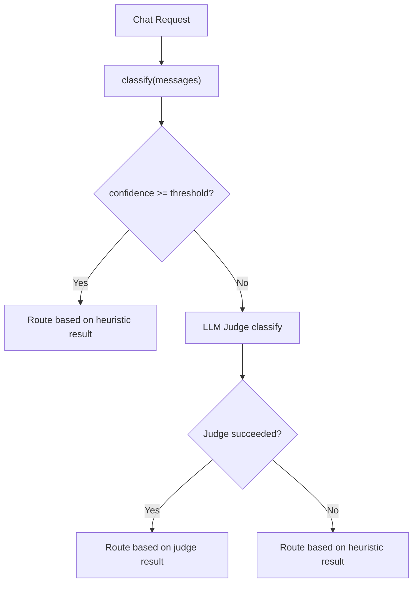

# Phase 3 — LLM-as-Judge Fallback

For the full delivery plan, see [ROADMAP.md](../../ROADMAP.md). For system design and routing strategy, see [ARCHITECTURE.md](../../ARCHITECTURE.md).

---

## Goal

- Use a small local LLM to classify tasks when heuristic confidence is low ([Zheng et al., 2023](https://arxiv.org/abs/2306.05685)).
- The judge provides a second opinion when keyword-based heuristics fail to identify the task type.
- Only triggered for `chat` requests — completions skip it entirely.
- Graceful degradation: if the judge fails, the router falls back to the heuristic result.

---

## Classifier Chain Integration

The engine evaluates classifiers in order and stops at the first confident result:

1. **Heuristics** (`classify(messages)`) — keyword matching, structural analysis (<1ms).
2. **LLM judge** — triggered only when heuristic confidence falls below the threshold.

The judge slot sits between heuristics and the future ML classifier (Phase 5). When the ML classifier is added later, the chain becomes: heuristics → ML classifier → LLM judge.



---

## Confidence Threshold

- The engine triggers the judge when heuristic confidence falls below `confidence_threshold` (default: `0.5`).
- The heuristic classifier produces these confidence levels:

| Confidence | Condition |
|---|---|
| `0.0` | Empty message |
| `0.2` | No keyword matches (GENERAL fallback) |
| `0.6` | One keyword match |
| `0.7` | One keyword match + structural signal (code-heavy or long prompt) |
| `0.8+` | Two or more keyword matches |

- With the default threshold of `0.5`, the judge triggers only for GENERAL fallback cases where no keywords matched.
- The threshold is configurable to allow tighter or looser triggering.

---

## Judge Model Selection

- The judge uses a small, fast model to minimize latency.
- The user can specify the model via `llm_judge.model` in config.
- When no model is specified, the engine auto-selects the cheapest local model from the registry.
- If no local model is available and no model is specified, the engine disables the judge and logs a warning.
- The judge model does not need to be separate from the routing registry — it can be any model Rex knows about.

---

## Classification Meta-Prompt

The judge receives a system prompt and the user's last message, then returns a structured JSON classification.

### System Prompt

The prompt lists all valid `TaskCategory` values dynamically and asks for a JSON response with `category` and `min_context_window`:

```
You are a coding task classifier. Analyze the user's message and classify it into exactly one category.

Valid categories: code_review, completion, debugging, documentation, explanation, general, generation, migration, optimization, refactoring, test_generation

Respond with a JSON object containing:
- "category": one of the valid categories listed above
- "min_context_window": minimum context window needed in tokens (null if no special requirement)

Respond ONLY with the JSON object, no other text.
```

### User Message

The judge extracts and sends only the last user message from the conversation — the same text the heuristic classifier analyzes.

### LiteLLM Call

```python
response = await litellm.acompletion(
    model=judge_model,
    messages=[
        {"role": "system", "content": JUDGE_SYSTEM_PROMPT},
        {"role": "user", "content": last_user_message},
    ],
    temperature=0.0,
    max_tokens=100,
)
```

---

## Response Parsing

The judge parses the model's response as JSON and validates each field:

| Field | Type | Required | Validation |
|---|---|---|---|
| `category` | string | yes | Must be a valid `TaskCategory` value |
| `min_context_window` | integer | no | Must be a valid integer if present |

- If JSON parsing fails, the judge returns `None` (fallback to heuristics).
- If `category` is missing or not a valid `TaskCategory`, the judge returns `None`.
- If `min_context_window` is present but not a valid integer, the field is set to `None`.

### JudgeResult

```python
@dataclass(frozen=True)
class JudgeResult:
    category: TaskCategory
    min_context_window: int | None = None
```

---

## How Judge Results Affect Routing

When the judge provides a result, the engine uses it for model selection:

- **`category`**: replaces the heuristic category. The engine creates a new `ClassificationResult` with the judge's category.
- **`confidence`**: the engine sets confidence to `0.9` (a fixed value indicating the judge is trusted more than low-confidence heuristics). LLM self-reported confidence is unreliable, so a fixed value is a more pragmatic choice.
- The engine then applies the standard `get_requirements(category)` logic to select the model — the same path as heuristic results.

---

## Error Handling

The judge follows the graceful degradation strategy:

| Failure | Behavior |
|---|---|
| Model returns non-JSON | Log warning, return `None`, use heuristic result |
| JSON missing required fields | Log warning, return `None`, use heuristic result |
| Invalid category value | Log warning, return `None`, use heuristic result |
| LiteLLM timeout | Log warning, return `None`, use heuristic result |
| LiteLLM error (any) | Log warning, return `None`, use heuristic result |

- The judge never raises exceptions to the caller.
- All failures are logged at `WARNING` level with the error details.

---

## Latency Guard

- The judge only runs for `CHAT` feature type requests.
- `COMPLETION` requests skip the judge entirely (the engine routes them to primary without classification).
- Expected latency: 200–500ms for a small local model.
- If the judge call fails or times out (via LiteLLM's default timeout), the exception handler catches it and returns `None`, falling back to heuristics.

---

## Config Schema

Add an `llm_judge` section at the top level:

```yaml
llm_judge:
  enabled: true
  model: "ollama/llama3.2:1b"
  confidence_threshold: 0.5
```

### LLMJudgeConfig

| Field | Type | Required | Default | Description |
|---|---|---|---|---|
| `llm_judge.enabled` | boolean | no | `false` | Enable the LLM judge fallback |
| `llm_judge.model` | string | no | `null` | Model to use for judging. When null, auto-selects the cheapest local model. |
| `llm_judge.confidence_threshold` | float | no | `0.5` | Heuristic confidence below this triggers the judge |

### Settings Extension

```python
class LLMJudgeConfig(BaseModel):
    enabled: bool = False
    model: str | None = None
    confidence_threshold: float = 0.5

class Settings(BaseModel):
    server: ServerConfig = ServerConfig()
    models: list[ModelConfig] = []
    routing: RoutingConfig = RoutingConfig()
    enrichments: EnrichmentsConfig = EnrichmentsConfig()
    llm_judge: LLMJudgeConfig = LLMJudgeConfig()
```

---

## Project Files

Phase 3 adds the judge module and modifies existing files:

```
app/
  config.py                # Add LLMJudgeConfig, extend Settings
  router/
    llm_judge.py           # LLM judge classifier
    engine.py              # Integrate judge into select_model (becomes async)
  proxy/
    handler.py             # await engine.select_model(...)
tests/
  test_llm_judge.py
  test_engine.py           # Updated for async select_model + judge integration
```

### router/llm_judge.py

- `JUDGE_SYSTEM_PROMPT` constant: the classification meta-prompt (dynamically lists valid categories).
- `JudgeResult` frozen dataclass: `category`, `min_context_window`.
- `LLMJudge` class:
  - `__init__(model: str)`.
  - `async classify(messages: list[dict]) -> JudgeResult | None`: extracts last user message, calls LiteLLM, parses JSON, validates fields, returns `JudgeResult` or `None` on failure.
- `_parse_judge_response(content: str) -> JudgeResult | None`: JSON parsing and validation (module-level function).
- `_extract_last_user_message(messages: list[dict]) -> str`: extracts last user message text (handles string and list content).

### router/engine.py (modified)

- `select_model` becomes `async select_model`.
- After heuristic classification, if `feature == CHAT` and `result.confidence < threshold` and judge is available, calls `await judge.classify(messages)`.
- If judge returns a result, the engine creates a new `ClassificationResult` with the judge's category and confidence `0.9`.
- `RoutingEngine.__init__` accepts optional `LLMJudge` instance and `confidence_threshold`.

### proxy/handler.py (modified)

- `await engine.select_model(...)` replaces the previous synchronous call.

### config.py (modified)

- `LLMJudgeConfig` Pydantic model with `enabled`, `model`, `confidence_threshold`.
- `Settings` gains `llm_judge: LLMJudgeConfig = LLMJudgeConfig()`.

---

## Verification

### Judge Triggers on Low Confidence

1. Enable the judge in config:
   ```yaml
   llm_judge:
     enabled: true
   ```
2. Send a request with no obvious keywords (heuristics return GENERAL at 0.2):
   ```bash
   curl -X POST http://localhost:8000/v1/chat/completions \
     -H "Content-Type: application/json" \
     -d '{"messages": [{"role": "user", "content": "Take this Python class and rewrite it in Rust, keeping the same interface"}]}'
   ```
3. Check logs for judge classification output.
4. Verify the response uses the judge's classification for routing.

### Judge Does Not Trigger on High Confidence

5. Send a request with clear debugging keywords:
   ```bash
   curl -X POST http://localhost:8000/v1/chat/completions \
     -H "Content-Type: application/json" \
     -d '{"messages": [{"role": "user", "content": "Fix this error: TypeError: undefined is not a function"}]}'
   ```
6. Verify the judge does not trigger (heuristic confidence ≥ threshold).

### Judge Fallback on Error

7. Configure an invalid judge model (e.g., `model: "nonexistent/model"`).
8. Send a low-confidence request.
9. Verify the router falls back to the heuristic result and the request succeeds.

### Tab Completions Skip Judge

10. Send a short single-turn completion:
    ```bash
    curl -X POST http://localhost:8000/v1/chat/completions \
      -H "Content-Type: application/json" \
      -d '{"messages": [{"role": "user", "content": "def fibonacci(n):"}], "max_tokens": 50, "temperature": 0}'
    ```
11. Verify the judge does not trigger.
