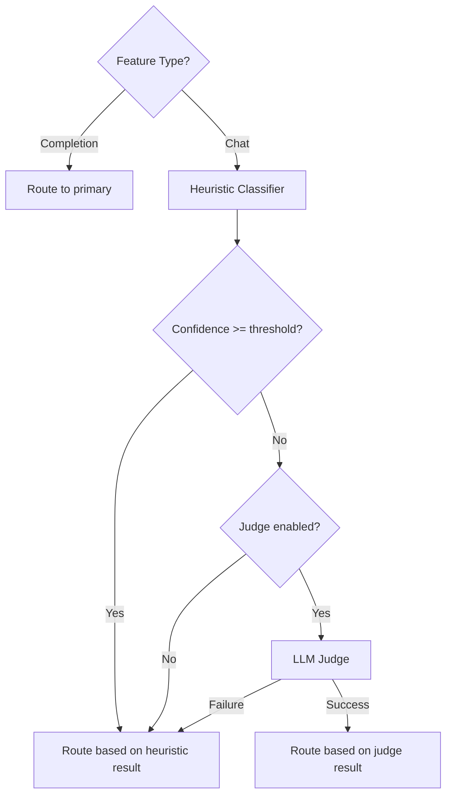

# Phase 3 — LLM-as-Judge Fallback

For the full delivery plan, see [ROADMAP.md](../../ROADMAP.md). For system design and routing strategy, see [ARCHITECTURE.md](../../ARCHITECTURE.md).

---

## Goal

- Use a small local LLM to classify the task when heuristic confidence is low ([Zheng et al., 2023](https://arxiv.org/abs/2306.05685)).
- Only trigger the judge for chat/agent requests — never for completions (latency guard).
- Parse the judge's structured JSON response into a `ClassificationResult`.
- Integrate into the classifier chain: heuristics → LLM judge (when uncertain) → route.

---

## Classifier Chain Integration

The routing engine currently classifies every chat request with heuristics and routes immediately. Phase 3 adds a conditional step:

1. Detect feature type (completion vs. chat).
2. If completion → route to primary (unchanged).
3. Classify with heuristics → get `ClassificationResult` (category + confidence).
4. **If confidence < threshold → call LLM judge for a second opinion.**
5. Route based on the classification result (from heuristics or judge).

- The judge only runs when heuristic confidence is below the threshold.
- If the judge call fails (timeout, parse error, model error), the engine falls back to the heuristic result.

---

## Config Schema

Add an `llm_judge` section to the existing config:

```yaml
llm_judge:
  enabled: true
  model: "ollama/llama3"
  confidence_threshold: 0.5
```

### LLMJudgeConfig

| Field | Type | Required | Default | Description |
|---|---|---|---|---|
| `llm_judge.enabled` | boolean | no | `false` | Enable the LLM judge fallback |
| `llm_judge.model` | string | no | `null` | LiteLLM model identifier. When omitted, Rex auto-selects the cheapest local model from the registry. If no local model is available, the judge is disabled. |
| `llm_judge.confidence_threshold` | float | no | `0.5` | Heuristic confidence below this value triggers the judge |

- The `llm_judge` section is optional — omitting it entirely disables the judge.
- The threshold applies to `ClassificationResult.confidence` from the heuristic classifier.

### Settings Extension

The existing `Settings` model gains a new optional field:

```python
class LLMJudgeConfig(BaseModel):
    enabled: bool = False
    model: str | None = None
    confidence_threshold: float = 0.5

class Settings(BaseModel):
    server: ServerConfig = ServerConfig()
    models: list[ModelConfig] = []
    routing: RoutingConfig = RoutingConfig()
    enrichments: EnrichmentsConfig = EnrichmentsConfig()
    llm_judge: LLMJudgeConfig = LLMJudgeConfig()
```

---

## LLM Judge Module

### Meta-Prompt

The judge receives the last user message and a system prompt that instructs it to classify the coding task:

```
You are a coding task classifier. Analyze the user's message and classify it into exactly one category.

Valid categories: completion, debugging, refactoring, optimization, test_generation, explanation, documentation, code_review, generation, migration, general

Respond with a JSON object containing:
- "category": one of the valid categories listed above
- "min_context_window": minimum context window needed in tokens (null if no special requirement)

Respond ONLY with the JSON object, no other text.
```

- The system prompt lists all valid `TaskCategory` values.
- The judge sends only the last user message as the user turn — not the full conversation.

### Judge Response Format

```json
{
  "category": "debugging",
  "min_context_window": null
}
```

### JudgeResult

```python
@dataclass(frozen=True)
class JudgeResult:
    category: TaskCategory
    min_context_window: int | None = None
```

- `category` maps directly to a `TaskCategory` enum value.
- `min_context_window` can override the category's default requirement from `CATEGORY_REQUIREMENTS` if the judge determines the task needs more context.

### JSON Parsing

- The judge calls `litellm.acompletion()` with the meta-prompt.
- Rex parses the response content as JSON using `json.loads()`.
- If the `category` value is not a valid `TaskCategory`, the judge result is discarded and the heuristic result is used.
- If JSON parsing fails, the judge result is discarded.

### Error Handling

The judge follows Rex's graceful degradation strategy:

| Failure | Behavior |
|---|---|
| LiteLLM call fails (timeout, connection, rate limit) | Log warning, use heuristic result |
| Response is not valid JSON | Log warning, use heuristic result |
| `category` is not a valid `TaskCategory` | Log warning, use heuristic result |
| Judge model not found in registry | Log warning at startup, disable judge |

- The judge never causes a request to fail — every error falls back to heuristics.

---

## Routing Engine Changes

`select_model()` becomes `async` to support the LLM judge call:

```python
async def select_model(
    self,
    messages: list[dict],
    max_tokens: int | None = None,
    temperature: float | None = None,
    feature_type: FeatureType | None = None,
) -> RoutingDecision:
```

- `handle_chat_completion` and `handle_text_completion` already run in async context, so adding `await` is a minimal change.
- The judge is only instantiated when `llm_judge.enabled` is `True` and a valid model is available.

### select_model Flow



---

## Latency Guard

- The judge only triggers for `FeatureType.CHAT` requests — never for `FeatureType.COMPLETION`.
- Expected latency: 200-500ms for a small local model via Ollama.
- Tab completions require sub-100ms latency, so the judge is excluded from that path.

---

## Project Files

Phase 3 adds the judge module and modifies existing files:

```
app/
  config.py                # Add LLMJudgeConfig, extend Settings
  router/
    llm_judge.py           # LLM judge module (meta-prompt, JSON parsing)
    engine.py              # Add judge step to select_model, make async
  proxy/
    handler.py             # await select_model calls
config.yaml.example       # Add llm_judge section
tests/
  test_llm_judge.py        # LLM judge unit tests
  test_engine.py           # Update for async select_model
  test_handler.py          # Update for async select_model
  test_config.py           # Tests for LLMJudgeConfig
```

### config.py (modified)

- `LLMJudgeConfig` Pydantic model: `enabled`, `model`, `confidence_threshold`.
- `Settings` gains `llm_judge: LLMJudgeConfig = LLMJudgeConfig()`.

### router/llm_judge.py (new)

- `JUDGE_SYSTEM_PROMPT` constant: the classification meta-prompt.
- `JudgeResult` dataclass: `category`, `min_context_window`.
- `LLMJudge` class:
  - `__init__(model: str)`: stores the LiteLLM model identifier.
  - `async classify(messages: list[dict]) -> JudgeResult | None`: calls LiteLLM, parses JSON, returns `None` on any failure.
- `_extract_last_user_message(messages) -> str`: reuses the same logic from `classifier.py`.
- `_parse_judge_response(content: str) -> JudgeResult | None`: parses JSON, validates category against `TaskCategory`.

### router/engine.py (modified)

- `select_model()` becomes `async`.
- `RoutingEngine.__init__` accepts optional `LLMJudge` and `confidence_threshold`.
- After heuristic classification, if confidence < threshold and judge is available, `await judge.classify(messages)`.
- If judge returns a result, use it; otherwise use heuristic result.

### proxy/handler.py (modified)

- `handle_chat_completion` calls `await engine.select_model(...)` instead of `engine.select_model(...)`.
- `handle_text_completion` calls `await engine.select_model(...)`.

### main.py (modified)

- Lifespan constructs `LLMJudge` when config enables it.
- Resolves judge model: uses `llm_judge.model` if set, otherwise picks cheapest local model from registry.
- Passes judge and threshold to `RoutingEngine`.

### config.yaml.example (modified)

- Add commented `llm_judge` section with all fields.

---

## Verification

### Judge Triggers on Low Confidence

1. Enable the judge in config with a model and threshold of `0.9` (high threshold so most requests trigger it).
2. Send a chat request with an ambiguous prompt:
   ```bash
   curl -X POST http://localhost:8000/v1/chat/completions \
     -H "Content-Type: application/json" \
     -d '{"messages": [{"role": "user", "content": "Can you help me with this code?"}]}'
   ```
3. Check logs for judge invocation and classification result.

### Judge Skips Completions

4. Send a tab completion request:
   ```bash
   curl -X POST http://localhost:8000/v1/chat/completions \
     -H "Content-Type: application/json" \
     -d '{"messages": [{"role": "user", "content": "def hello"}], "max_tokens": 50, "temperature": 0}'
   ```
5. Verify logs show no judge invocation.

### Judge Failure Falls Back to Heuristics

6. Configure the judge with an invalid model name.
7. Send a chat request — verify Rex routes successfully using heuristic classification.

### Judge Disabled by Default

8. Remove the `llm_judge` section from config.
9. Send requests — verify no judge invocations in logs.
