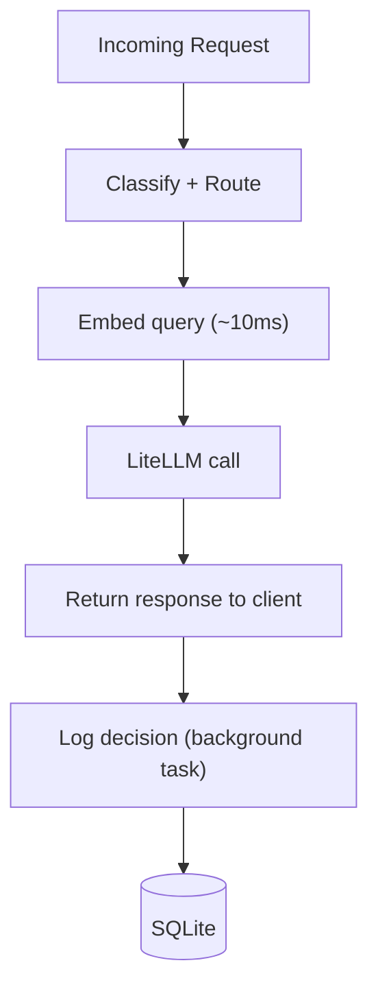
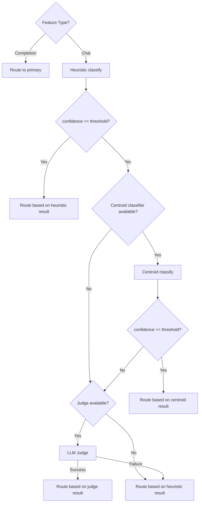

# Phase 4 — Decision Logging + Embedding Pipeline

For the full delivery plan, see [ROADMAP.md](../../ROADMAP.md). For system design and routing strategy, see [ARCHITECTURE.md](../../ARCHITECTURE.md).

---

## Goal

- Build the data collection infrastructure that feeds the learning pipeline (Phase 5).
- Log every routing decision with enough detail for outcome tracking and retraining.
- Embed every query with a local sentence transformer (~10ms, zero API cost).
- Pre-seed cluster centroids from synthetic exemplar queries so nearest-centroid classification works from the first query.
- Introduce the centroid classifier as step 2 in the classifier chain (between heuristics and LLM judge).

---

## Decision Logging

### DecisionRecord

Each routing decision produces a record with these fields:

| Field | Type | Source |
|---|---|---|
| `timestamp` | `datetime` | `datetime.utcnow()` at request start |
| `prompt_hash` | `str` | SHA-256 of the last user message |
| `category` | `str` | `TaskCategory` value from classification |
| `confidence` | `float` | Classifier confidence |
| `feature_type` | `str` | `FeatureType` value (`completion` or `chat`) |
| `selected_model` | `str` | Model name from `RoutingDecision` |
| `used_model` | `str` | Model that served the request (differs from `selected_model` if fallback triggered) |
| `response_time_ms` | `int` | Wall time from LiteLLM call to response |
| `input_tokens` | `int \| None` | From `response.usage.prompt_tokens` |
| `output_tokens` | `int \| None` | From `response.usage.completion_tokens` |
| `cost` | `float \| None` | From `litellm.completion_cost()` |
| `fallback_triggered` | `bool` | `True` if the selected model failed and a fallback served the request |
| `rule_votes` | `dict[str, float] \| None` | Heuristic scores per category (the full `scores` dict) |
| `embedding` | `bytes \| None` | Serialized query embedding (384-dim float32 array) |

### Storage Interface

The logging module uses the repository pattern. Core logic depends on the protocol, not the implementation.

```python
class DecisionRepository(Protocol):
    async def save(self, record: DecisionRecord) -> None: ...
    async def get_recent(self, limit: int) -> list[DecisionRecord]: ...
    async def count(self) -> int: ...
    async def get_embeddings(self) -> list[tuple[str, bytes]]: ...
```

- `save`: persists a single decision record.
- `get_recent`: returns the most recent records, ordered by timestamp descending.
- `count`: returns the total number of stored records.
- `get_embeddings`: returns `(prompt_hash, embedding)` pairs for clustering.

### SQLite Implementation

Default storage backend. Uses Python's `sqlite3` via `asyncio.to_thread()` to avoid blocking the event loop.

```sql
CREATE TABLE IF NOT EXISTS decisions (
    id INTEGER PRIMARY KEY AUTOINCREMENT,
    timestamp TEXT NOT NULL,
    prompt_hash TEXT NOT NULL,
    category TEXT NOT NULL,
    confidence REAL NOT NULL,
    feature_type TEXT NOT NULL,
    selected_model TEXT NOT NULL,
    used_model TEXT NOT NULL,
    response_time_ms INTEGER NOT NULL,
    input_tokens INTEGER,
    output_tokens INTEGER,
    cost REAL,
    fallback_triggered INTEGER NOT NULL DEFAULT 0,
    rule_votes TEXT,
    embedding BLOB
);

CREATE INDEX IF NOT EXISTS idx_decisions_timestamp ON decisions(timestamp);
CREATE INDEX IF NOT EXISTS idx_decisions_category ON decisions(category);
```

- `rule_votes` is stored as a JSON string.
- `embedding` is stored as a BLOB (raw bytes of the float32 numpy array).
- The database file path defaults to `~/.rex/decisions.db`.
- The implementation creates the directory and database file on first write.

### Integration Into Request Flow

The handler logs the decision after the response completes, without blocking the response to the client.



- `handle_chat_completion` measures response time with `time.perf_counter()` around `_call_with_fallback`.
- After the response is built, the handler fires a background task (`asyncio.create_task`) to save the `DecisionRecord`.
- Token count comes from the LiteLLM response's `usage` field. For streaming responses, usage may not be available — the handler logs `None` in that case.
- Cost comes from `litellm.completion_cost(completion_response=response)`. If cost calculation fails, the handler logs `None`.
- `handle_text_completion` logs decisions the same way.

### ClassificationResult Extension

The heuristic classifier currently returns `ClassificationResult(category, confidence)`. Phase 4 extends it with the full scores dict so rule votes can be logged:

```python
@dataclass(frozen=True)
class ClassificationResult:
    category: TaskCategory
    confidence: float
    scores: dict[TaskCategory, float] = field(default_factory=dict)
```

- `scores` contains every category that received a non-zero score, with its score value.
- The classifier already computes this dict internally — the change is returning it instead of discarding it.
- The `scores` dict feeds into the weak supervision label model in Phase 5.

---

## Embedding Pipeline

### Sentence Transformer

Rex loads a local sentence transformer model at startup to embed every query.

| Property | Value |
|---|---|
| Model | [all-MiniLM-L6-v2](https://huggingface.co/sentence-transformers/all-MiniLM-L6-v2) |
| Embedding dimension | 384 |
| Model size | ~80MB |
| Inference time | ~10ms per query on CPU |
| API cost | Zero (runs locally) |
| Reference | [Reimers & Gurevych, 2019](https://arxiv.org/abs/1908.10084) |

### EmbeddingService

```python
class EmbeddingService:
    def __init__(self, model_name: str = "all-MiniLM-L6-v2") -> None: ...
    def embed(self, text: str) -> np.ndarray: ...
    def embed_batch(self, texts: list[str]) -> np.ndarray: ...
```

- The constructor loads the model from the HuggingFace cache (downloads on first use).
- `embed` returns a 384-dimensional float32 numpy array.
- `embed_batch` embeds multiple texts in a single forward pass (used at startup for synthetic exemplars).

### Per-Request Embedding

- The handler embeds the last user message before the LiteLLM call.
- The embedding is stored alongside the decision log.
- Embedding runs synchronously — 10ms is negligible compared to LLM latency.
- Tab completions (`FeatureType.COMPLETION`) skip embedding to minimize latency.

### Graceful Degradation

- If `sentence-transformers` is not installed, the embedding service is disabled.
- Rex logs a warning at startup and proceeds without embeddings.
- Decision logging still works — the `embedding` field is `None`.
- The centroid classifier is also disabled (it depends on embeddings).

---

## Centroid Classifier

### Synthetic Exemplars

For each predefined `TaskCategory`, Rex defines 3–5 representative queries that typify the category:

| Category | Example Exemplars |
|---|---|
| `debugging` | "fix this null pointer exception", "why is this test failing with AssertionError", "getting a segfault when I run this" |
| `refactoring` | "refactor this class to use dependency injection", "simplify this function", "extract this logic into a separate method" |
| `optimization` | "this function is too slow, how can I speed it up", "reduce memory usage in this loop", "optimize this database query" |
| `test_generation` | "write unit tests for this class", "add test coverage for the edge cases", "generate pytest tests for this API" |
| `explanation` | "explain how this decorator works", "what does this regex do", "why does Python use the GIL" |
| `documentation` | "write a docstring for this function", "generate API docs for this module", "update the README with usage examples" |
| `code_review` | "review this pull request for security issues", "is this implementation correct", "what could go wrong with this approach" |
| `generation` | "build a REST API with authentication", "create a CLI tool that parses CSV files", "implement a binary search tree" |
| `migration` | "upgrade this project from Python 3.9 to 3.12", "migrate from SQLAlchemy to raw SQL", "convert this JavaScript to TypeScript" |

- Exemplars are defined as a constant dict in the centroids module.
- `completion` and `general` categories do not need exemplars — they are handled by heuristics and the fallback path.

### Centroid Computation

At startup:

1. The embedding service embeds all exemplars in a batch.
2. For each category, the system computes the centroid (mean of exemplar embeddings).
3. Centroids are stored in memory as a `dict[TaskCategory, np.ndarray]`.

### Nearest-Centroid Classification

For each query:

1. The embedding service produces the query embedding.
2. The centroid classifier computes cosine similarity between the query embedding and every category centroid.
3. The category with the highest similarity wins.
4. Confidence = cosine similarity of the winning category (range: 0.0–1.0).

```python
class CentroidClassifier:
    def __init__(self, centroids: dict[TaskCategory, np.ndarray]) -> None: ...
    def classify(self, embedding: np.ndarray) -> ClassificationResult: ...
```

### Classifier Chain Integration

Phase 4 adds the centroid classifier as step 2 in the chain, between heuristics and the LLM judge:

1. **Heuristics** — keyword matching, structural analysis (<1ms).
2. **Centroid classifier** — nearest-centroid in embedding space (<50ms). Only runs if heuristics are not confident.
3. **LLM judge** — small local LLM (200–500ms). Only runs if both heuristics and centroid are not confident.



- The centroid classifier uses the same `confidence_threshold` as the heuristics/judge decision. When cosine similarity is below the threshold, it falls through to the next classifier.
- The centroid classifier produces a standard `ClassificationResult(category, confidence, scores)` — the engine handles it the same way as heuristic results.

---

## Config Schema

Add a `learning` section to the existing config:

```yaml
learning:
  db_path: "~/.rex/decisions.db"
  embeddings_model: "all-MiniLM-L6-v2"
```

### LearningConfig

| Field | Type | Required | Default | Description |
|---|---|---|---|---|
| `learning.db_path` | string | no | `"~/.rex/decisions.db"` | Path to the SQLite database for decision logs |
| `learning.embeddings_model` | string | no | `"all-MiniLM-L6-v2"` | Sentence transformer model name |

### Settings Extension

```python
class LearningConfig(BaseModel):
    db_path: str = "~/.rex/decisions.db"
    embeddings_model: str = "all-MiniLM-L6-v2"

class Settings(BaseModel):
    server: ServerConfig = ServerConfig()
    models: list[ModelConfig] = []
    routing: RoutingConfig = RoutingConfig()
    enrichments: EnrichmentsConfig = EnrichmentsConfig()
    llm_judge: LLMJudgeConfig = LLMJudgeConfig()
    learning: LearningConfig = LearningConfig()
```

---

## Dependencies

Phase 4 adds these dependencies:

| Dependency | Purpose |
|---|---|
| `sentence-transformers` | Local sentence transformer model for query embeddings |
| `numpy` | Embedding vectors, cosine similarity |

- `sentence-transformers` pulls in `torch` as a transitive dependency (~2GB). The model itself is ~80MB.
- If `sentence-transformers` is not installed, Rex skips embeddings and centroids but still logs decisions.
- `sqlite3` is part of Python's standard library — no extra dependency for decision logging.

---

## Project Files

Phase 4 adds the logging and learning modules, and modifies existing files:

```
app/
  config.py                  # Add LearningConfig, extend Settings
  logging/
    __init__.py
    models.py                # DecisionRecord dataclass
    repository.py            # DecisionRepository protocol
    sqlite.py                # SQLite implementation
  learning/
    __init__.py
    embeddings.py            # EmbeddingService (sentence transformer)
    centroids.py             # CentroidClassifier + synthetic exemplars
  router/
    classifier.py            # ClassificationResult gains scores field
    engine.py                # Integrate centroid classifier + accept logging deps
  proxy/
    handler.py               # Measure response time, fire logging task
  main.py                    # Initialize logging, embeddings, centroids
tests/
  test_decision_logging.py
  test_embeddings.py
  test_centroids.py
  test_classifier.py         # Updated for scores field
  test_engine.py             # Updated for centroid classifier
```

### logging/models.py

- `DecisionRecord` dataclass with all fields from the schema above.

### logging/repository.py

- `DecisionRepository` protocol: `save`, `get_recent`, `count`, `get_embeddings`.

### logging/sqlite.py

- `SQLiteDecisionRepository` class implementing `DecisionRepository`.
- `__init__(db_path: str)`: creates the directory and database file if needed.
- Uses `asyncio.to_thread()` to run SQLite operations off the event loop.
- `_init_db()`: creates the table and indexes on first use.

### learning/embeddings.py

- `EmbeddingService` class: loads the sentence transformer model, provides `embed(text)` and `embed_batch(texts)`.
- `try_load_embedding_service(model_name) -> EmbeddingService | None`: factory that returns `None` if `sentence-transformers` is not installed.

### learning/centroids.py

- `EXEMPLAR_QUERIES: dict[TaskCategory, list[str]]` constant with synthetic exemplars per category.
- `build_centroids(embedding_service) -> dict[TaskCategory, np.ndarray]`: embeds exemplars and computes category centroids.
- `CentroidClassifier` class: `__init__(centroids)`, `classify(embedding) -> ClassificationResult`.
- Confidence is the cosine similarity to the nearest centroid.

### router/classifier.py (modified)

- `ClassificationResult` gains `scores: dict[TaskCategory, float]` field.
- `classify()` returns the full `scores` dict alongside `category` and `confidence`.

### router/engine.py (modified)

- `RoutingEngine.__init__` accepts optional `CentroidClassifier`.
- After heuristic classification, if confidence < threshold and centroid classifier is available, runs centroid classification.
- The centroid result follows the same requirements-matching logic as heuristic results.

### proxy/handler.py (modified)

- `handle_chat_completion` measures response time, extracts tokens/cost from LiteLLM response, and fires a background task to log the `DecisionRecord`.
- Accepts optional `DecisionRepository` and `EmbeddingService` parameters.

### main.py (modified)

- Lifespan initializes `SQLiteDecisionRepository`, `EmbeddingService` (if available), `CentroidClassifier` (if embeddings available).
- Passes logging and embedding dependencies to the handler and engine.

### config.py (modified)

- `LearningConfig` Pydantic model with `db_path` and `embeddings_model`.
- `Settings` gains `learning: LearningConfig = LearningConfig()`.

---

## Verification

### Decision Logging

1. Start Rex and send a few chat requests.
2. Open the SQLite database (`~/.rex/decisions.db`).
3. Verify each request produced a row with the expected fields (timestamp, category, model, response time, etc.).

### Embedding Storage

4. Check that the `embedding` column in the decisions table contains non-null BLOBs for chat requests.
5. Verify tab completions have `NULL` embeddings.

### Centroid Classifier

6. Send a request with no keyword matches but clear semantic intent (e.g., "Take this Python class and rewrite it in Rust, keeping the same interface").
7. Check logs for centroid classifier activation and the classified category.
8. Verify the centroid classifier correctly identifies the task type based on semantic similarity rather than keywords.

### Graceful Degradation

9. Uninstall `sentence-transformers`.
10. Start Rex and verify it logs a warning but starts successfully.
11. Send requests and verify decision logging works (with `NULL` embeddings).
12. Verify the centroid classifier is disabled and requests fall through to the LLM judge or heuristics.

### Rule Votes

13. Send a request that matches multiple categories (e.g., contains both "fix" and "refactor").
14. Check the `rule_votes` column in the database.
15. Verify it contains scores for multiple categories.
