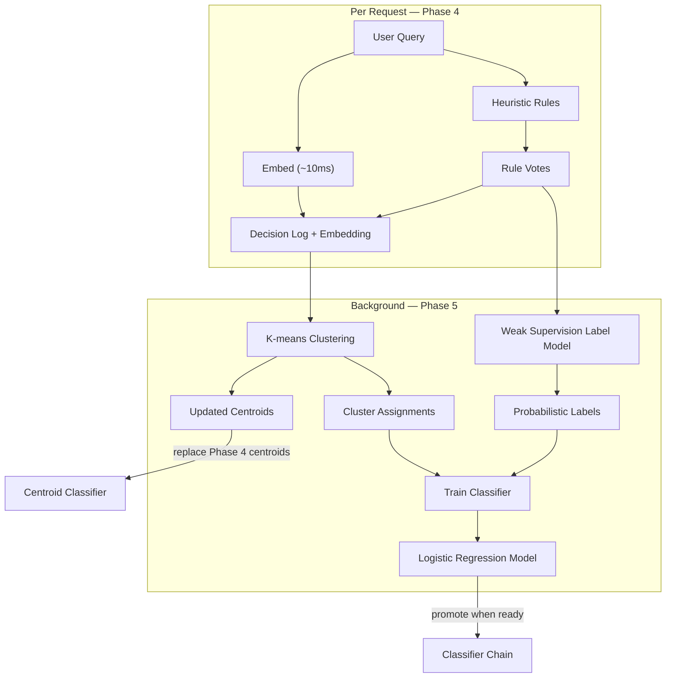
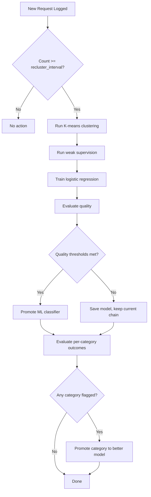

# Phase 5 — Learning Pipeline + ML Classifier

For the full delivery plan, see [ROADMAP.md](../../ROADMAP.md). For system design and routing strategy, see [ARCHITECTURE.md](../../ARCHITECTURE.md).

---

## Goal

- Train a personalized ML classifier from accumulated data using unsupervised clustering and weak supervision.
- The ML classifier replaces heuristics as the primary router once it reaches quality thresholds.
- Track per-category outcomes and promote categories to more capable models when cheap models consistently fail.
- All training runs locally — no data leaves the user's machine.

---

## Architecture Overview

The learning pipeline runs in the background, consuming data from Phase 4's decision logs and embeddings.



Three background processes run periodically:
- **Clustering**: re-groups stored embeddings with K-means.
- **Weak supervision**: aggregates heuristic rule votes into clean labels.
- **Training**: trains a logistic regression classifier on the combined labels.

---

## Clustering

### K-means on Stored Embeddings

The clustering module reads stored embeddings from the decision log (Phase 4) and runs K-means clustering.

- Embeddings are 384-dimensional vectors from the sentence transformer.
- K-means groups queries by semantic similarity, discovering natural task categories.
- Categories that emerge from clustering may differ from the predefined ones — they reflect how the individual user actually works.

### Optimal Cluster Count

The module selects the optimal K using [silhouette score](https://doi.org/10.1016/0377-0427(87)90125-7) (Rousseeuw, 1987):

1. Run K-means for K = 2, 3, ..., `max_k` (default: 20).
2. Compute silhouette score for each K.
3. Select the K with the highest silhouette score.

- Silhouette score ranges from -1 to 1. Values above 0.5 indicate well-separated clusters.
- Unsupervised clustering on query embeddings can match oracle-level routing accuracy ([Neurometric, 2026](https://neurometric.substack.com/p/unsupervised-llm-routing-matching)).

### Periodic Re-clustering

- Re-clustering triggers every `recluster_interval` queries (default: 100).
- The scheduler checks the decision log count on each request and triggers re-clustering in the background when the threshold is reached.
- After re-clustering, the updated centroids replace Phase 4's pre-seeded centroids in the centroid classifier.

### Cluster Output

```python
@dataclass
class ClusteringResult:
    centroids: dict[int, np.ndarray]
    assignments: dict[str, int]  # prompt_hash -> cluster_id
    silhouette: float
    k: int
```

---

## Weak Supervision

### Heuristic Rules as Labeling Functions

Each heuristic rule in the classifier acts as a noisy labeling function ([Ratner et al., 2017](https://arxiv.org/abs/1711.10160)). The `rule_votes` field from Phase 4's decision log contains the scores each rule assigned to each category.

- A labeling function votes for a category when its score is above zero.
- Multiple labeling functions can disagree on the same query.
- No labeling function is perfectly accurate — they are "noisy" by design.

### Label Model

The label model learns each labeling function's reliability from agreement/disagreement patterns and produces clean probabilistic labels without any ground-truth annotations.

The label model tracks:

| Metric | Description |
|---|---|
| Per-rule accuracy | How often each rule agrees with the majority vote |
| Per-rule coverage | What fraction of queries each rule votes on |
| Agreement matrix | Pairwise agreement rates between rules |

Label generation:

1. For each query, collect all rule votes from the decision log.
2. Weight each vote by the rule's learned accuracy.
3. Produce a probabilistic label: `P(category | votes)` via weighted majority vote.
4. The label model re-estimates rule accuracies after each re-training cycle.

### Label Model Convergence

The label model converges when rule accuracy estimates stabilize across re-training cycles. Convergence is measured by the maximum change in any rule's accuracy estimate between consecutive cycles.

- Convergence threshold: max accuracy change < 0.05.
- The label model converges when enough data is available for the voting patterns to stabilize (typically after 200–500 queries).

---

## ML Classifier

### Evolution Path

The ML classifier evolves through two stages:

| Stage | Classifier | When |
|---|---|---|
| Phase 4 | Nearest-centroid (pre-seeded exemplars) | From the first query |
| Phase 5 | Logistic regression (trained on real data) | After clustering stabilizes + label model converges |

### Logistic Regression

- Input features: 384-dimensional query embeddings from the sentence transformer.
- Output: probability distribution over `TaskCategory` values.
- Training data: cluster-derived labels + weak supervision probabilistic labels.
- Implementation: `sklearn.linear_model.LogisticRegression` with `multi_class="multinomial"`.

### Training Pipeline

1. Read stored embeddings and rule votes from the decision log.
2. Run clustering → get cluster assignments.
3. Run weak supervision → get probabilistic labels.
4. Combine: for each query, the training label is the weighted average of the cluster assignment's mapped category and the weak supervision label.
5. Train logistic regression on (embedding, label) pairs.
6. Evaluate on a held-out validation split (20%).

### Category Mapping

Clusters discovered by K-means are unlabeled (cluster 0, 1, 2, ...). The system maps clusters to `TaskCategory` values:

1. For each cluster, examine the rule votes of queries assigned to it.
2. The category with the highest average rule vote across the cluster's queries becomes the cluster's label.
3. If a cluster has no dominant category (no rule votes), it gets a `GENERAL` label.
4. New clusters that don't map to any predefined category receive a `GENERAL` label. Future phases may support dynamic category creation.

### Model Persistence

- The trained model is saved to disk with `joblib.dump()`.
- Path: `~/.rex/ml_classifier.joblib`.
- The model is loaded at startup if available.
- Re-training overwrites the persisted model.

### Inference

```python
class MLClassifier:
    def __init__(self, model_path: str) -> None: ...
    def classify(self, embedding: np.ndarray) -> ClassificationResult: ...
    def is_trained(self) -> bool: ...
```

- `classify` returns a `ClassificationResult` with the predicted category and confidence (max predicted probability).
- The ML classifier produces a standard `ClassificationResult` — the engine handles it the same way as heuristic or centroid results.

---

## Automatic Promotion

### Quality Thresholds

The ML classifier replaces heuristics as the primary classifier when both conditions are met:

| Condition | Threshold | Rationale |
|---|---|---|
| Silhouette score | > 0.5 | Clusters are well-separated and stable |
| Label model convergence | Max accuracy change < 0.05 | Rule reliability estimates have stabilized |

### Promotion Mechanics

Before promotion (Phase 3 + Phase 4 chain):

1. Heuristics (fast path, <1ms)
2. Centroid classifier (<50ms)
3. LLM judge (200–500ms)

After promotion:

1. ML classifier (primary, <50ms)
2. LLM judge (fallback, 200–500ms)

- Heuristics no longer participate in routing — they run only as labeling functions for the weak supervision pipeline.
- The centroid classifier is replaced by the trained logistic regression classifier.
- The LLM judge remains as the final fallback for uncertain cases.

### Demotion Safety

- If the ML classifier's quality degrades (silhouette drops below 0.4), the system reverts to the pre-promotion chain.
- Quality is re-evaluated after each re-training cycle.

---

## Outcome Tracking

### Per-Category Metrics

The outcome tracker aggregates metrics from decision logs per category over a sliding window (default: last 50 requests per category).

| Metric | How it is measured |
|---|---|
| Fallback rate | % of requests where `fallback_triggered = True` |
| Error rate | % of requests where all models failed (no response logged) |
| Average latency | Mean `response_time_ms` |
| Re-ask rate | % of requests followed by another request with the same `prompt_hash` within 60 seconds |

- Metrics are computed on-demand from the decision log — no separate storage needed.
- The re-ask rate requires comparing consecutive decision records by `prompt_hash` and timestamp.

---

## Upward Migration

### Detection

The outcome tracker flags categories with persistent poor outcomes:

| Signal | Trigger |
|---|---|
| High fallback rate | > 30% over the sliding window |
| High error rate | > 10% over the sliding window |
| High re-ask rate | > 40% over the sliding window |

When a category is flagged, the system promotes it to the next more capable model.

### Category Promotion

- "Promote" means overriding the category's default `TaskRequirements` to require a more capable model.
- The override is stored in the decision database (not in the YAML config — it is learned, not configured).
- The routing engine checks for category overrides before applying the default requirements.

### Promotion Logic

1. The outcome tracker evaluates each category's metrics after every N requests (default: 50).
2. If a category exceeds any trigger threshold, the system identifies the next model up in cost order that has better capabilities (larger context window, supports reasoning, etc.).
3. The system stores the override: `category → updated TaskRequirements`.
4. On the next request for that category, the engine uses the updated requirements.

### Demotion

- Categories are not automatically demoted.
- If a user wants to reset migrations, they delete the decisions database (`~/.rex/decisions.db`).
- Future phases may add automatic demotion when metrics improve.

---

## Re-training Scheduler

The scheduler coordinates the background processes:



- Re-training runs in the background using `asyncio.create_task()`.
- The scheduler tracks the query count since the last re-training.
- Re-training does not block request handling.
- If a re-training cycle is already running, new triggers are ignored until it completes.

---

## Config Schema

Extend the `learning` section from Phase 4:

```yaml
learning:
  db_path: "~/.rex/decisions.db"
  embeddings_model: "all-MiniLM-L6-v2"
  recluster_interval: 100
  max_k: 20
  promotion_silhouette_threshold: 0.5
  migration_window: 50
```

### LearningConfig Extension

| Field | Type | Required | Default | Description |
|---|---|---|---|---|
| `learning.recluster_interval` | integer | no | `100` | Number of new queries between re-clustering runs |
| `learning.max_k` | integer | no | `20` | Maximum K to try during K-means cluster count selection |
| `learning.promotion_silhouette_threshold` | float | no | `0.5` | Silhouette score above this promotes the ML classifier |
| `learning.migration_window` | integer | no | `50` | Number of recent requests per category to evaluate for upward migration |

### Settings Extension

```python
class LearningConfig(BaseModel):
    db_path: str = "~/.rex/decisions.db"
    embeddings_model: str = "all-MiniLM-L6-v2"
    recluster_interval: int = 100
    max_k: int = 20
    promotion_silhouette_threshold: float = 0.5
    migration_window: int = 50
```

---

## Dependencies

Phase 5 adds these dependencies (on top of Phase 4's):

| Dependency | Purpose |
|---|---|
| `scikit-learn` | K-means clustering, silhouette score, logistic regression |
| `joblib` | Model persistence (save/load trained classifier) |

---

## Project Files

Phase 5 adds the learning pipeline modules and modifies existing files:

```
app/
  learning/
    clustering.py            # K-means clustering + silhouette score
    labeling.py              # Weak supervision label model
    trainer.py               # ML classifier training pipeline
    scheduler.py             # Re-training scheduler
    outcomes.py              # Per-category outcome tracking
    migrations.py            # Upward migration logic
  router/
    ml_classifier.py         # Trained ML classifier (logistic regression)
    engine.py                # Integrate ML classifier promotion + category overrides
  config.py                  # Extend LearningConfig
tests/
  test_clustering.py
  test_labeling.py
  test_trainer.py
  test_scheduler.py
  test_outcomes.py
  test_migrations.py
  test_ml_classifier.py
  test_engine.py             # Updated for ML classifier promotion
```

### learning/clustering.py

- `cluster_embeddings(embeddings, max_k) -> ClusteringResult`: runs K-means for K = 2..max_k, selects best K by silhouette score.
- `ClusteringResult` dataclass: `centroids`, `assignments`, `silhouette`, `k`.

### learning/labeling.py

- `LabelModel` class: tracks per-rule accuracy, coverage, agreement matrix.
- `fit(rule_votes_history) -> None`: re-estimates rule accuracies from stored votes.
- `predict(rule_votes) -> dict[TaskCategory, float]`: produces probabilistic label for a single query.
- `is_converged() -> bool`: checks if accuracy estimates have stabilized.

### learning/trainer.py

- `train_classifier(embeddings, cluster_result, label_model, repository) -> MLClassifier | None`: end-to-end training pipeline.
- Maps clusters to categories using rule votes.
- Combines cluster assignments with weak supervision labels.
- Trains logistic regression and evaluates on validation split.
- Returns `None` if not enough data is available.

### learning/scheduler.py

- `RetrainingScheduler` class: tracks query count, triggers re-training cycles.
- `on_new_decision(repository) -> None`: called after each decision log. Triggers re-training when interval is reached.
- Runs re-training as a background task. Ignores overlapping triggers.

### learning/outcomes.py

- `OutcomeTracker` class: computes per-category metrics from decision logs.
- `evaluate(category, repository, window) -> CategoryMetrics`: returns fallback rate, error rate, average latency, re-ask rate.
- `CategoryMetrics` dataclass with the four metrics.

### learning/migrations.py

- `check_migrations(repository, tracker, window) -> list[CategoryMigration]`: evaluates all categories, returns migrations for flagged ones.
- `CategoryMigration` dataclass: `category`, `current_requirements`, `new_requirements`, `trigger_reason`.
- `apply_migration(migration, repository) -> None`: stores the requirements override in the database.

### router/ml_classifier.py

- `MLClassifier` class: loads a trained logistic regression model from disk.
- `classify(embedding) -> ClassificationResult`: predicts category + confidence.
- `is_trained() -> bool`: checks if a persisted model file exists.

### router/engine.py (modified)

- `RoutingEngine` accepts optional `MLClassifier` and category requirement overrides.
- After ML classifier promotion, the engine uses ML classifier as the primary step.
- Before applying default `CATEGORY_REQUIREMENTS`, the engine checks for category overrides from the migration table.

---

## Verification

### Clustering

1. Accumulate 100+ decision logs with embeddings (via normal usage or synthetic requests).
2. Trigger re-clustering manually or wait for the scheduler.
3. Verify the clustering result has a silhouette score and centroids.
4. Check that the centroid classifier now uses the updated centroids.

### Weak Supervision

5. Verify the label model produces probabilistic labels from rule votes.
6. Send requests that match multiple categories and check that the label model resolves the ambiguity.

### ML Classifier Training

7. After enough data (200+ queries), verify that the trainer produces a logistic regression model.
8. Check that `~/.rex/ml_classifier.joblib` exists after training.
9. Restart Rex and verify the model loads from disk.

### Automatic Promotion

10. After the silhouette score exceeds 0.5 and the label model converges, verify the classifier chain switches to ML classifier as primary.
11. Check logs for the promotion event.

### Outcome Tracking

12. Send a series of requests for a specific category (e.g., debugging) and simulate failures (e.g., by using an unreliable model).
13. Verify the outcome tracker detects the high fallback rate.

### Upward Migration

14. After the outcome tracker flags a category, verify the system promotes it to a more capable model.
15. Send new requests for that category and verify they route to the upgraded model.
16. Check the decisions database for the stored category override.
