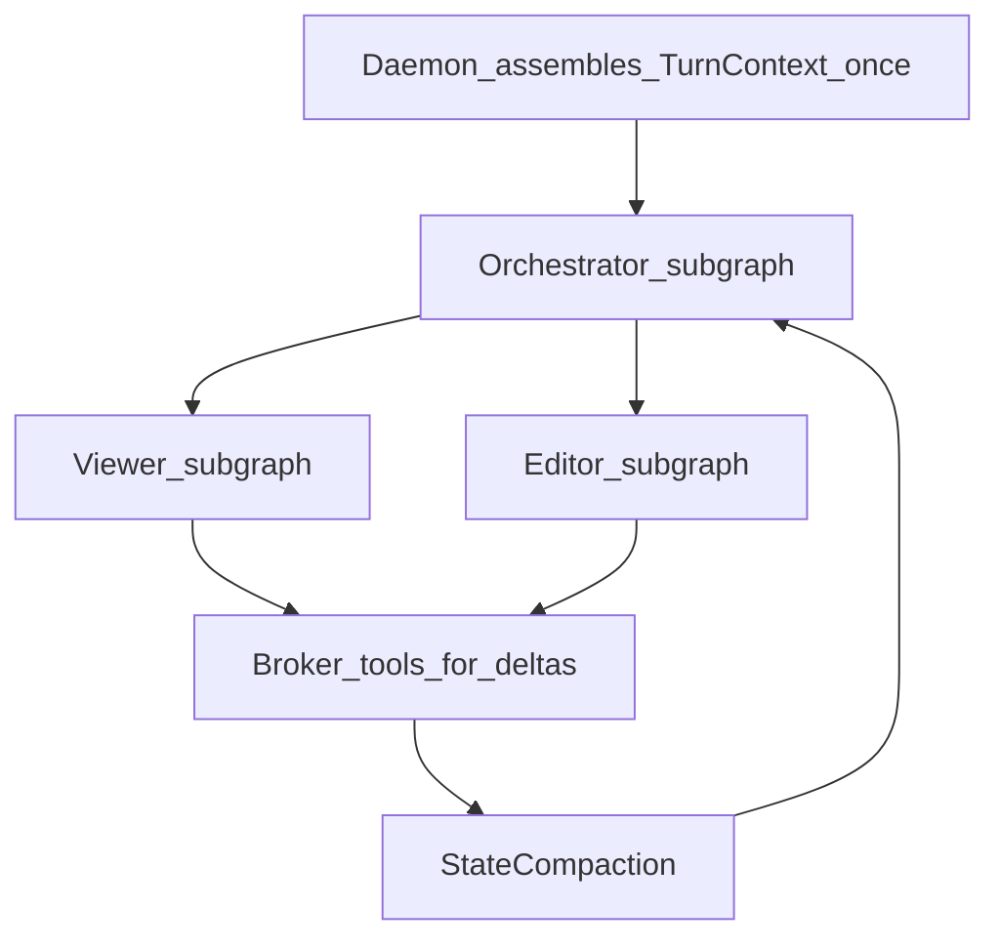

# rex-agent — design contract

**Status:** LangGraph ReAct loop shipped (**R018**). gRPC scaffold (**R017**). Operator defaults (**R019**). Broker policy (**R020–R022**). Interim tool protocol: JSON in model text until **R038** native `tools` on `BrokerInference` — [NATIVE_TOOL_CALLING.md](../../docs/NATIVE_TOOL_CALLING.md).

**Target graph:** Orchestrator + Viewer + Editor — [AGENT_GRAPH_ARCHITECTURE.md](../../docs/AGENT_GRAPH_ARCHITECTURE.md), [ADR 0022](../../docs/architecture/decisions/0022-viewer-editor-subagent-topology.md). Wire formats: [ADR 0023](../../docs/architecture/decisions/0023-hybrid-agent-serialization-boundaries.md).

Bootstrap: [README.md](README.md).

Canonical capability ownership: [DEVELOPMENT_ASSISTANCE_CAPABILITIES.md](../../docs/DEVELOPMENT_ASSISTANCE_CAPABILITIES.md). ADRs: [0011](../../docs/architecture/decisions/0011-workspace-binding-and-turn-context-authority.md)–[0017](../../docs/architecture/decisions/0017-single-active-sidecar-phase-1.md).

## Purpose

Python sidecar implementing the product development agent: LangGraph ReAct loop, **broker-only** LLM and host tools, `rex.sidecar.v1` server.

## Consumes

| Input | Source |
|-------|--------|
| `RunTurn(prompt, mode, model?)` | Daemon supervisor — Phase 1: `prompt` is daemon-enriched turn string |
| `turn_id`, `context_revision` (optional) | Phase 1b proto — correlation only |
| Broker gRPC (via daemon UDS) | `BrokerInference`, `BrokerReadFile`, `BrokerListDir`, `BrokerWriteFile`, `BrokerExecShell` |

## Does not implement

- Lexical workspace indexer or `[context]` assembly — **daemon** `ContextPipeline`
- Layered prompts, `KnowledgeRetrieval`, `ProjectMemoryRetrieval` — **daemon** ([ADR 0012](../../docs/architecture/decisions/0012-layered-prompt-assemblies.md), [0014](../../docs/architecture/decisions/0014-long-term-memory-boundary.md), [0015](../../docs/architecture/decisions/0015-agent-knowledge-bundles.md))
- Chat transcript persistence — **extension**
- Direct OpenAI keys or ambient host FS/network

## Per-turn vs intra-turn (conflicts C3, T5)

**Shipped (**R027–R032**, **R031**):** Orchestrator / Viewer / Editor routing via `active_subagent`, `RexBrokerChatModel`, `add_messages` + compaction node, diff-only writes, read dedup, goal-hint read pruning (`read_pruning_enabled`, default off), metrics — see `src/rex_agent/graph.py` and `src/rex_agent/graph/`.

- **Per turn start:** Treat `RunTurn.prompt` as the authoritative initial model input (includes daemon-injected context). Do not re-read the same files via broker unless the workspace may have changed.
- **Intra-turn:** Tool outputs live in graph/scratch state; cap size to `max_tool_result_bytes` (aligned with daemon broker truncation per [ADR 0013](../../docs/architecture/decisions/0013-access-policy-broker-completion.md)).
- **`max_tool_steps`:** From R015 config (default **12**, [CONFIGURATION.md](../../docs/CONFIGURATION.md)); stop with terminal message when exceeded.
- **`compaction_suffix_fraction`**, **`read_pruning_enabled`:** Sidecar intra-turn controls — see [CONFIGURATION.md](../../docs/CONFIGURATION.md) and [AGENT_GRAPH_ARCHITECTURE.md](../../docs/AGENT_GRAPH_ARCHITECTURE.md).

## Wire format (broker payloads)

| Contract | Owner | Status |
|----------|-------|--------|
| Interim tool/final JSON in model text | Sidecar `RexBrokerChatModel` | Shipped — until **R038** native `tools[]`; interim fallback retained — [NATIVE_TOOL_CALLING.md](../../docs/NATIVE_TOOL_CALLING.md), [ADR 0023](../../docs/architecture/decisions/0023-hybrid-agent-serialization-boundaries.md) |
| Raw delimited broker results | Daemon `broker.rs` shapes `BrokerReadFile` / `BrokerExecShell` | **Shipped (R034)** — `<<TOOL_RESULT:tool>>` … `<<END>>`; line-boundary truncation at `broker.max_tool_result_bytes`; sidecar strips for internal read/write paths |
| Microcompaction before inference | Sidecar graph | Shipped (R029) — stale reads (>2 steps) → stubs |
| Multi-line write args | Sidecar | Shipped (R030) — unified diff path |

Delimited payloads reuse existing gRPC string fields (`content`, `stdout`). **R038** adds additive proto fields for native `tools[]` / `tool_calls` — hub [NATIVE_TOOL_CALLING.md](../../docs/NATIVE_TOOL_CALLING.md).

## R038 — Native broker tool calling (partial)

**PR 1 Done** (daemon): additive `BrokerInference` wire, `http_openai_compat` forwarding, Ollama `/api/show` probe. **PR 2 Done** (sidecar): route native `tool_calls` in `llm.py`; one-step interim JSON fallback per step when daemon reports `interim_fallback`. **PR 3** (planned): operator E2E script on direct Ollama. Default config: direct Ollama + `native_tools: auto`. Hub: [NATIVE_TOOL_CALLING.md](../../docs/NATIVE_TOOL_CALLING.md).

## R033 — MCP gRPC client (Phase 2 — deferred)

MCP gRPC client remains **out of scope** until **R038** ships ([ADR 0016](../../docs/architecture/decisions/0016-mcp-in-sidecar-envelope.md), milestone **R033** rescoped to MCP-only).

## Mode matrix

| Mode | Tools |
|------|-------|
| `ask` | None — inference only |
| `plan` | `fs.read`, `fs.list` |
| `agent` | `fs.read`, `fs.list`, `fs.write`, `exec.shell` (allowlisted) |

Approvals: extension supplies `approval_id`; daemon `ApprovalGate` for `agent` ([ADR 0009](../../docs/architecture/decisions/0009-centralized-agent-approvals-and-checkpoints.md)).

## Streaming

Emit `RunTurnChunk` incrementally to daemon; daemon passthrough to `rex.v1` clients ([AGENT_DELIVERY_ROADMAP.md](../../docs/AGENT_DELIVERY_ROADMAP.md)).

## Harness

CI and local tests may use **`rex-sidecar-stub`** instead; switch via `REX_SIDECAR_BINARY` or R015 `sidecars` config.

## Market benchmark

- **LangGraph agents** often grow context with full tool transcripts — REX caps scratch and relies on daemon initial assembly.
- **Cascade-style analytics** — daemon logs per-stage tokens; sidecar should not duplicate metering.

## Related

- [AGENT_GRAPH_ARCHITECTURE.md](../../docs/AGENT_GRAPH_ARCHITECTURE.md) — target topology and token playbook
- [AGENT_DELIVERY_ROADMAP.md](../../docs/AGENT_DELIVERY_ROADMAP.md)
- [SIDECAR_RUNTIME.md](../../docs/SIDECAR_RUNTIME.md)
- [proto/rex/sidecar/v1/sidecar.proto](../../proto/rex/sidecar/v1/sidecar.proto)
