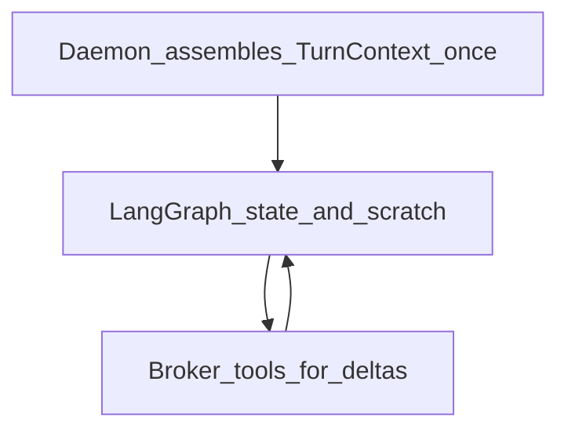

# rex-agent — design contract

**Status:** LangGraph ReAct loop shipped (**R018**). gRPC scaffold (**R017**). Operator defaults (**R019**). Broker policy (**R020–R022**). Interim tool protocol: JSON in model text until native `tools` on `BrokerInference` (follow-up).

Bootstrap: [README.md](README.md).

Canonical capability ownership: [DEVELOPMENT_ASSISTANCE_CAPABILITIES.md](../../docs/DEVELOPMENT_ASSISTANCE_CAPABILITIES.md). ADRs: [0011](../../docs/architecture/decisions/0011-workspace-binding-and-turn-context-authority.md)–[0017](../../docs/architecture/decisions/0017-single-active-sidecar-phase-1.md).

## Purpose

Python sidecar implementing the product development agent: LangGraph ReAct loop, **broker-only** LLM and host tools, `rex.sidecar.v1` server.

## Consumes

| Input | Source |
|-------|--------|
| `RunTurn(prompt, mode, model?)` | Daemon supervisor — Phase 1: `prompt` is daemon-enriched turn string |
| `turn_id`, `context_revision` (optional) | Phase 1b proto — correlation only |
| Broker gRPC (via daemon UDS) | `BrokerInference`, `BrokerReadFile`, `BrokerListDir`, `BrokerWriteFile`, `BrokerExecShell` |

## Does not implement

- Lexical workspace indexer or `[context]` assembly — **daemon** `ContextPipeline`
- Layered prompts, `KnowledgeRetrieval`, `ProjectMemoryRetrieval` — **daemon** ([ADR 0012](../../docs/architecture/decisions/0012-layered-prompt-assemblies.md), [0014](../../docs/architecture/decisions/0014-long-term-memory-boundary.md), [0015](../../docs/architecture/decisions/0015-agent-knowledge-bundles.md))
- Chat transcript persistence — **extension**
- Direct OpenAI keys or ambient host FS/network

## Per-turn vs intra-turn (conflicts C3, T5)

- **Per turn start:** Treat `RunTurn.prompt` as the authoritative initial model input (includes daemon-injected context). Do not re-read the same files via broker unless the workspace may have changed.
- **Intra-turn:** Tool outputs live in graph/scratch state; cap size to `max_tool_result_bytes` (aligned with daemon broker truncation per [ADR 0013](../../docs/architecture/decisions/0013-access-policy-broker-completion.md)).
- **`max_tool_steps`:** From R015 config (default 8); stop with terminal message when exceeded.

## Mode matrix

| Mode | Tools |
|------|-------|
| `ask` | None — inference only |
| `plan` | `fs.read`, `fs.list` |
| `agent` | `fs.read`, `fs.list`, `fs.write`, `exec.shell` (allowlisted) |

Approvals: extension supplies `approval_id`; daemon `ApprovalGate` for `agent` ([ADR 0009](../../docs/architecture/decisions/0009-centralized-agent-approvals-and-checkpoints.md)).

## Streaming

Emit `RunTurnChunk` incrementally to daemon; daemon passthrough to `rex.v1` clients ([AGENT_DELIVERY_ROADMAP.md](../../docs/AGENT_DELIVERY_ROADMAP.md)).

## Harness

CI and local tests may use **`rex-sidecar-stub`** instead; switch via `REX_SIDECAR_BINARY` or R015 `sidecars` config.

## Market benchmark

- **LangGraph agents** often grow context with full tool transcripts — REX caps scratch and relies on daemon initial assembly.
- **Cascade-style analytics** — daemon logs per-stage tokens; sidecar should not duplicate metering.

## Related

- [AGENT_DELIVERY_ROADMAP.md](../../docs/AGENT_DELIVERY_ROADMAP.md)
- [SIDECAR_RUNTIME.md](../../docs/SIDECAR_RUNTIME.md)
- [proto/rex/sidecar/v1/sidecar.proto](../../proto/rex/sidecar/v1/sidecar.proto)
